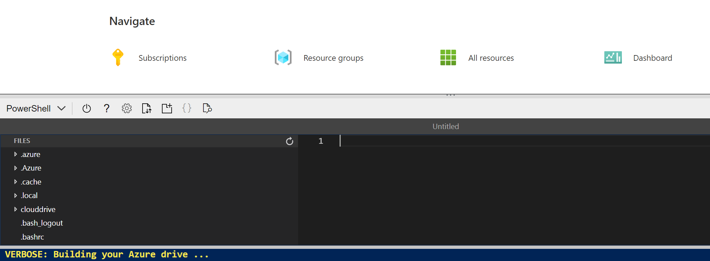

---
lab:
  title: Exploración de Cognitive Services
---

# <a name="explore-cognitive-services"></a>Exploración de Cognitive Services

> **Nota** Para completar este laboratorio, necesitará una [suscripción de Azure](https://azure.microsoft.com/free?azure-portal=true) en la que tenga acceso de administrador.

Azure Cognitive Services encapsula la funcionalidad de inteligencia artificial común que se puede clasificar en cuatro pilares principales: visión, voz, lenguaje y servicios de decisión. En este ejercicio, echará un vistazo a uno de los servicios de decisión para obtener una idea general de cómo aprovisionar y usar un recurso de Cognitive Services en una aplicación de software.

El servicio cognitivo específico que explorará en este ejercicio es *Anomaly Detector*. Anomaly Detector se usa para analizar los valores de datos a lo largo del tiempo y para detectar valores inusuales que puedan indicar un problema o un problema para una investigación más detallada. Por ejemplo, un sensor de una instalación de almacenamiento controlada por temperatura podría supervisar la temperatura cada minuto y registrar los valores medidos. Puede usar el servicio Anomaly Detector para analizar los valores de temperatura registrados y marcar cualquier que se encuentre significativamente fuera del intervalo normal de temperaturas esperadas.

Para probar las funcionalidades del servicio de detección de anomalías, usaremos una sencilla aplicación de línea de comandos que se ejecuta en Cloud Shell. Los mismos principios y funcionalidad se aplican en soluciones reales, como sitios web o aplicaciones de teléfono.

> **Nota** El objetivo de este ejercicio es obtener una idea general de cómo se aprovisionan y usan cognitive Services. Anomaly Detector se usa como ejemplo, pero no se espera que obtenga un conocimiento completo de la detección de anomalías en este ejercicio.

## <a name="create-an-anomaly-detector-resource"></a>Creación de un recurso de *Anomaly Detector*

Para empezar, vamos a crear un recurso de **Anomaly Detector** en la suscripción de Azure:

1. En otra pestaña del explorador, abra Azure Portal en [https://portal.azure.com](https://portal.azure.com?azure-portal=true) e inicie sesión con su cuenta Microsoft.

1. Haga clic en el botón **&#65291;Crear un recurso**, busque *Anomaly Detector* y cree un recurso de **Anomaly Detector** con la configuración siguiente:
    - **Suscripción**: *su suscripción a Azure*.
    - **Grupo de recursos**: *seleccione un grupo de recursos existente o cree uno*.
    - **Región**: *elija cualquier región disponible*.
    - **Nombre**: *escriba un nombre único*.
    - **Plan de tarifa**: F0 gratis.

1. Revise y cree el recurso. Espere a que se complete la implementación y, a continuación, vaya al recurso implementado.

1. Vea la página **Claves y punto de conexión** de su recurso de Anomaly Detector. Necesitará el punto de conexión y las claves para conectarse desde las aplicaciones cliente.

## <a name="run-cloud-shell"></a>Ejecución de Cloud Shell

Para probar las funcionalidades del servicio Anomaly Detector, usaremos una sencilla aplicación de línea de comandos que se ejecuta en Cloud Shell en Azure.

1. En Azure Portal, seleccione el botón **[>_]** (*Cloud Shell*) situado en la parte superior de la página, a la derecha del cuadro de búsqueda. Se abre un panel de Cloud Shell en la parte inferior del portal.

    

1. La primera vez que abra Cloud Shell, es posible que se le pida que elija el tipo de shell que desea usar (*Bash* o *PowerShell*). Seleccione **PowerShell**. Si no ve esta opción, omita el paso.  

1. Si se le pide que cree almacenamiento para Cloud Shell, asegúrese de que se haya especificado su suscripción y seleccione **Crear almacenamiento**. A continuación, espere un minuto más o menos a que se cree el almacenamiento.

    

1. Asegúrese de que el tipo de shell indicado en la parte superior izquierda del panel de Cloud Shell se cambia a *PowerShell*. Si es *Bash*, cambie a *PowerShell* mediante el menú desplegable.

    

1. Espere a que se inicie PowerShell. Debería ver la siguiente pantalla en Azure Portal:  

    

## <a name="configure-and-run-a-client-application"></a>Configuración y ejecución de una aplicación cliente

Ahora que tiene un entorno de Cloud Shell, puede ejecutar una aplicación sencilla que use el servicio Anomaly Detector para analizar datos.

1. En el shell de comandos, escriba el siguiente comando para descargar la aplicación de ejemplo y guárdela en una carpeta llamada ai-900.

    ```PowerShell
    git clone https://github.com/MicrosoftLearning/AI-900-AIFundamentals ai-900
    ```

    >**Consejo** Si ya usó este comando en otro laboratorio para clonar el repositorio *ai-900*, puede omitir este paso.

1. Los archivos se descargan en una carpeta llamada **ai-900**. Ahora queremos ver todos los archivos del almacenamiento de Cloud Shell y trabajar con ellos. Escriba el siguiente comando en el shell:

     ```PowerShell
    code .
    ```

    Observe cómo se abre un editor como el de la imagen siguiente: 

    

1. En el panel **Archivos** de la izquierda, expanda **ai-900** y seleccione **detect-anomalies.ps1**. Este archivo contiene código que usa el servicio de detección de anomalías, como se muestra aquí:

    

1. No se preocupe demasiado por los detalles del código; lo importante es que necesita la dirección URL del punto de conexión y cualquiera de las claves para el recurso de Anomaly Detector. Cópielos desde la página **Claves y puntos de conexión** del recurso (que debe seguir apareciendo en la parte superior del explorador) y péguelos en el editor de código, pero reemplace los valores de marcador de posición **YOUR_KEY** y **YOUR_ENDPOINT**, respectivamente.

    > **Consejo** Es posible que tenga que usar la barra de separación para ajustar el área de pantalla mientras trabaja con los paneles **Claves y punto de conexión** y **Editor**.

    Después de pegar los valores de clave y punto de conexión, las dos primeras líneas de código deben tener un aspecto similar al siguiente:

    ```PowerShell
    $key="1a2b3c4d5e6f7g8h9i0j...."    
    $endpoint="https..."
    ```

1. En la parte superior derecha del panel del editor, use el botón **...** para abrir el menú y seleccione **Guardar** para guardar los cambios. A continuación, vuelva a abrir el menú y seleccione **Cerrar editor**.

    Recuerde que la detección de anomalías es una técnica de inteligencia artificial que se usa para determinar si los valores de una serie están entre los parámetros esperados. La aplicación cliente de ejemplo usará el servicio Anomaly Detector para analizar un archivo que contiene una serie de fechas y horas, así como valores numéricos. La aplicación debe devolver resultados que indiquen en cada momento si el valor numérico está dentro de los parámetros esperados.

1. En el panel de PowerShell, escriba los siguientes comandos para ejecutar el código:

    ```PowerShell
    cd ai-900
    .\detect-anomalies.ps1
    ```

1. Revise los resultados y tenga en cuenta que la columna final de los resultados sea **True** o **False** para indicar si el valor registrado en cada fecha y hora se considera una anomalía o no. Considere cómo podríamos usar esta información en una situación real. ¿Qué acción podría desencadenar la aplicación si los valores fueran de temperatura del frigorífico o presión sanguínea y se detectaran anomalías?  

## <a name="learn-more"></a>Más información

Esta sencilla aplicación muestra solo algunas de las funcionalidades del servicio Anomaly Detector. Para obtener más información sobre lo que puede hacer con este servicio, consulte la [página de Anomaly Detector](https://azure.microsoft.com/services/cognitive-services/anomaly-detector/).

## <a name="clean-up"></a>Limpieza

Se recomienda, al final de un proyecto, identificar si aún necesita los recursos creados. Los recursos que se dejan en ejecución pueden costarle mucho dinero. 

Si va a continuar con otros módulos de aspectos básicos de IA, puede conservar los recursos para usarlos en otros laboratorios.

Si ha finalizado el aprendizaje, puede eliminar el grupo de recursos o los recursos individuales de su suscripción de Azure:

1. En [Azure Portal](https://portal.azure.com/), en la página **Grupos de recursos**, abra el grupo de recursos que haya especificado al crear el recurso.

2. Haga clic en **Eliminar grupo de recursos**, escriba el nombre del grupo de recursos para confirmar que quiere eliminarlo y seleccione **Eliminar**. También puede optar por eliminar recursos individuales. Para ello, seleccione los recursos, haga clic en los tres puntos para ver más opciones y haga clic en **Eliminar**.