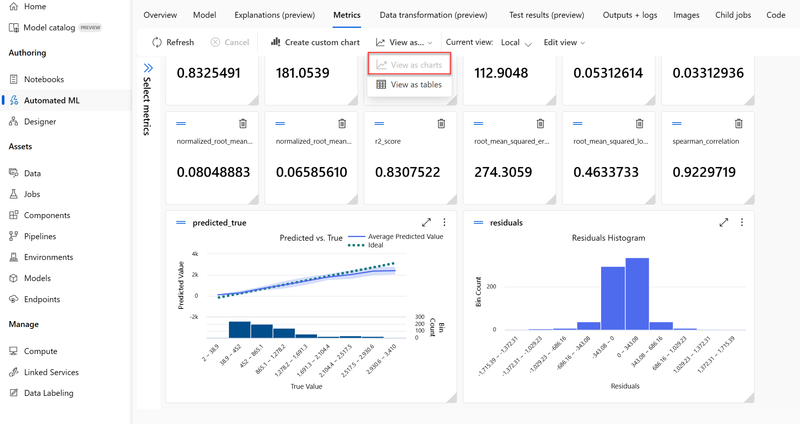

---
lab:
  title: Exploración de Machine Learning automatizado en Azure ML
  module: Module 2 - Machine Learning
---

# <a name="explore-automated-machine-learning-in-azure-ml"></a>Exploración de Machine Learning automatizado en Azure ML

> **Nota** Para completar este laboratorio, necesitará una [suscripción de Azure](https://azure.microsoft.com/free?azure-portal=true) en la que tenga acceso de administrador.

En este ejercicio, usará un conjunto de datos de información histórica de alquiler de bicicletas para entrenar un modelo que prediga el número de alquileres de bicicletas que se espera un día determinado, en función de las características estacionales y meteorológicas.

## <a name="create-an-azure-machine-learning-workspace"></a>Creación de un área de trabajo de Azure Machine Learning  

1. Inicie sesión en [Azure Portal](https://portal.azure.com?azure-portal=true) con las credenciales de Microsoft.

1. Seleccione **+Crear un recurso**, busque *Machine Learning* y cree un recurso de **Azure Machine Learning** con un plan *Azure Machine Learning*. Use la configuración siguiente:
    - **Suscripción**: *su suscripción a Azure*.
    - **Grupo de recursos**: *cree o seleccione un grupo de recursos*.
    - **Nombre del área de trabajo**: *escriba un nombre único para el área de trabajo*.
    - **Región**: *seleccione la región geográfica más cercana*.
    - **Cuenta de almacenamiento**: *tenga en cuenta la nueva cuenta de almacenamiento predeterminada que se creará para el área de trabajo*.
    - **Almacén de claves**: *tenga en cuenta el nuevo almacén de claves predeterminado que se creará para el área de trabajo*.
    - **Application Insights**: *tenga en cuenta el nuevo recurso de Application Insights predeterminado que se creará para el área de trabajo*.
    - **Registro de contenedor**: ninguno (*se creará uno automáticamente la primera vez que implemente un modelo en un contenedor*).

1. Seleccione **Revisar y crear** y, luego, **Crear**. Espere a que se cree el área de trabajo (puede tardar unos minutos) y, a continuación, vaya al recurso implementado.

1. Seleccione **Iniciar estudio** (o abra una nueva pestaña del explorador y vaya a [https://ml.azure.com](https://ml.azure.com?azure-portal=true) e inicie sesión en estudio de Azure Machine Learning con su cuenta de Microsoft).

1. Si aparece el mensaje **¿Cuáles son los objetivos de aprendizaje automático hoy?** , seleccione **Cancelar**.

1. Si aparece el mensaje **¡Le damos la bienvenida al estudio!** , seleccione **X**.

1. En estudio de Azure Machine Learning, debería ver el área de trabajo recién creada. Si no es así, haga clic en **Microsoft** en el menú de la izquierda. A continuación, en el nuevo menú de la izquierda, seleccione **Áreas de trabajo**, donde se muestran todas las áreas de trabajo asociadas a la suscripción. Elija la que creó para este ejercicio. 

> **Nota** Este módulo es uno de los muchos que hacen uso de un área de trabajo Azure Machine Learning, incluidos el resto de módulos de la ruta de aprendizaje[Microsoft Azure AI Fundamentals: exploración de las herramientas visuales para el aprendizaje automático](https://docs.microsoft.com/learn/paths/create-no-code-predictive-models-azure-machine-learning/). Si usa su propia suscripción de Azure, le recomendamos que cree el área de trabajo una vez y la reutilice en otros módulos. A la suscripción de Azure se le cargará un importe reducido por el almacenamiento de datos, siempre y cuando el área de trabajo de Azure Machine Learning exista en la suscripción, por lo que se recomienda eliminar el área de trabajo de Azure Machine Learning cuando ya no sea necesaria.

## <a name="create-compute"></a>Creación del proceso

1. En [estudio de Azure Machine Learning](https://ml.azure.com?azure-portal=true), seleccione las tres líneas de la parte superior izquierda para ver las distintas páginas de la interfaz (es posible que tenga que maximizar el tamaño de la pantalla). Puede usar estas páginas del panel de la izquierda para administrar los recursos del área de trabajo. Vea la página **Proceso** (en **Administrar**).

1. En la página **Proceso**, seleccione la pestaña **Clústeres de proceso** y agregue un clúster de proceso nuevo con la configuración siguiente. Lo usará para entrenar un modelo de Machine Learning:
    - **Ubicación**: *seleccione la misma que el área de trabajo. Si esa ubicación no aparece, elija la más cercana.*
    - **Nivel de máquina virtual**: dedicado
    - **Tipo de máquina virtual**: CPU
    - **Tamaño de la máquina virtual**:
        - Elija **Seleccionar de entre todas las opciones**
        - Busque y seleccione **Standard_DS11_v2**
    - Seleccione **Siguiente**.
    - **Nombre del proceso**: *escriba un nombre único*.
    - **Número mínimo de nodos**: 0
    - **Número máximo de nodos**: 2
    - **Segundos de inactividad antes de la reducción vertical**: 120
    - **Habilitar acceso SSH**: Eliminar
    - Seleccione **Crear**

> **Nota** Las instancia de proceso y los clústeres se basan en imágenes de máquina virtual de Azure estándar. Para este módulo, se recomienda la imagen *Standard_DS11_v2* para lograr el equilibrio óptimo entre el costo y el rendimiento. Si la suscripción tiene una cuota que no incluye esta imagen, elija una imagen alternativa, pero tenga en cuenta que una imagen más grande puede incurrir en un costo mayor y una imagen más pequeña puede no ser suficiente para completar las tareas. Como alternativa, pida al administrador de Azure que amplíe la cuota.

El clúster de proceso tardará algún tiempo en crearse. Mientras espera, puede continuar con el siguiente paso.

## <a name="create-a-dataset"></a>Crear un conjunto de datos

1. Vea los datos separados por comas en [https://aka.ms/bike-rentals](https://aka.ms/bike-rentals?azure-portal=true), en el explorador web.

1. En [Estudio de Azure Machine Learning](https://ml.azure.com?azure-portal=true), expanda el panel izquierdo seleccionando las tres líneas de la parte superior izquierda de la pantalla. Vea la página **Datos** (en **Activos**). La página Datos contiene archivos de datos o tablas específicos con los que tiene previsto trabajar en Azure Machine Learning. También puede crear conjuntos de datos desde esta página.

1. En la página **Datos**, en la pestaña **Recursos de datos**, seleccione **Crear**. A continuación, configure un recurso de datos con las siguientes opciones:
    * **Tipo de datos**:
        * **Nombre**: bike-rentals.
        * **Descripción**: datos de alquiler de bicicletas.
        * **Tipo de conjunto de datos**: tabular
    * **Origen de datos**: desde archivos web
    * **Dirección URL web**: 
        * **Dirección URL web**: [https://aka.ms/bike-rentals](https://aka.ms/bike-rentals?azure-portal=true)
        * **Omitir validación de datos**: *no seleccionar*.
    * **Configuración**:
        * **Formato de archivo**: delimitado
        * **Delimitador**: coma
        * **Codificación**: UTF-8
        * **Encabezados de columna**: solo el primer archivo tiene encabezados
        * **Omitir filas**: ninguno
        * **Dataset contains multi-line data (El conjunto de datos contiene datos de varias líneas)**: *no seleccionar*
    * **Esquema**:
        * incluir todas las columnas que no sean **Ruta de acceso**
        * Revisar los tipos detectados automáticamente
    * **Revisar**
        * Seleccione **Crear**

1. Después de crear el conjunto de datos, ábralo y vea la página **Explorar** para obtener una muestra de los datos. Estos datos contienen las características históricas y las etiquetas para los alquileres de bicicletas.

> **Cita**: *Estos datos se derivan de [Capital Bikeshare](https://www.capitalbikeshare.com/system-data) y se utilizan de acuerdo con el [contrato de licencia](https://www.capitalbikeshare.com/data-license-agreement) de los datos publicados.*

## <a name="run-an-automated-machine-learning-job"></a>Cancelar un trabajo de aprendizaje automático automatizado

Siga los pasos para ejecutar un trabajo que use el aprendizaje automático automatizado con el fin de entrenar un modelo de regresión que prediga los alquileres de bicicletas.

1. En [Azure Machine Learning Studio](https://ml.azure.com?azure-portal=true), vea la página **ML automatizado** (en **Autor**).

1. Cree un trabajo de ML automatizado con la configuración siguiente:
    - **Seleccionar recurso de datos**:
        - **Conjunto de datos**: bike-rentals.
    - **Configurar trabajo**:
        - **Nuevo nombre del experimento**: mslearn-bike-rental.
        - **Columna de destino**: alquileres (*esta es la etiqueta que tiene que predecir el modelo entrenado)*.
        - **Select Azure ML compute cluster** (Seleccionar el clúster de proceso de Azure ML): *el clúster de proceso que creó anteriormente.*
    - **Selección de tarea y configuración**: 
        - **Tipo de tarea**: regresión *(el modelo predice un valor numérico)*. 

    

    Observe que en el tipo de tarea hay las opciones *View additional configuration settings* (Ver opciones de configuración adicionales) y *View Featurization settings* (Ver opciones de caracterización). Ahora configure estas opciones.

    - **Opciones de configuración adicionales**:
        - **Métrica primaria**: seleccione **Error de desviación media cuadrática normalizada**
        - **Explain best model** (Explicar el mejor modelo): seleccionado: *esta opción hace que el aprendizaje automático automatizado calcule la importancia de la característica para el mejor modelo, lo que permite determinar la influencia de cada característica en la etiqueta de predicción*.
        - **Use all supported models** (Usar todos los modelos admitidos): <u>no</u> seleccionado. *Restringirá el trabajo para probar solo algunos algoritmos específicos.*
        - **Allowed models** (Modelos permitidos): *seleccione solo **RandomForest** y **LightGBM**: normalmente, le gustaría probar tantos como sea posible, pero cada modelo agregado aumenta el tiempo que se tarda en ejecutar el experimento*.

        
        - **Criterio de salida**:
            - **Training job time (hours)** (Tiempo del trabajo de entrenamiento [horas]): 0,5: *esto hace que el experimento finalice después de un máximo de 30 minutos*.
            - **Metric score threshold** (Umbral de puntuación de métrica): 0,085: *esto hace que el experimento finalice si un modelo logra una puntuación de métrica de raíz del error cuadrático medio normalizado de 0,085 o menos*.
        - **Simultaneidad**: *no cambiar*.
    - **Configuración de caracterización**:
        - **Enable featurization** (Habilitar caracterización): seleccionada: *procese previamente de forma automática las características antes del entrenamiento*.

    Haga clic en **Siguiente** para ir al siguiente panel de selección.

    - **Seleccione el tipo de validación y prueba**
        - **Tipo de validación**: Automático
        - **Recurso de datos de prueba (versión preliminar):** no se requiere ningún recurso de datos de prueba

1. Cuando termine de enviar los detalles de la ejecución de ML automatizado, se iniciará automáticamente. Espere a que el estado de ejecución cambie de *Preparando* a *En ejecución*.

1. Cuando el estado de ejecución cambia a *En ejecución*, vea la pestaña **Modelos** y observe que se prueba cada combinación posible de algoritmos de entrenamiento y pasos de preprocesamiento y se evalúa el rendimiento del modelo resultante. La página se actualiza frecuentemente de forma automática, pero también puede seleccionar **Actualizar**. Los modelos pueden tardar unos 10 minutos en aparecer, ya que los nodos de clúster se deben inicializar antes de que pueda comenzar el entrenamiento.

1. espere a que el trabajo finalice. Este proceso puede tardar un poco. Ahora podría ser un buen momento para hacer una pausa.

## <a name="review-the-best-model"></a>Revisión del mejor modelo

1. En la pestaña **Visión general** de la ejecución del aprendizaje automático automatizado, tenga en cuenta el resumen del mejor modelo.
    

    >[!NOTE]
    > Es posible que vea un mensaje bajo el estado "Advertencia: Se alcanzó la puntuación de salida especificada por el usuario...". Este es un comportamiento esperado. Continúe con la sección siguiente.  
1. Seleccione el texto bajo **Nombre del algoritmo** para el mejor modelo a fin de ver sus detalles.

1. Junto al valor del *Error de desviación media cuadrática normalizada*, seleccione **Ver todas las demás métricas** a fin de ver los valores de otras métricas posibles de evaluación para un modelo de regresión.

    

1. Seleccione la pestaña **Métricas** y seleccione los gráficos **valores residuales** y **predicted_true** si aún no están seleccionados. 
    

    Revise los gráficos en los que se muestran el rendimiento del modelo. En el primer gráfico se muestran los *valores residuales*, las diferencias entre los valores previstos y reales, como un histograma; el segundo gráfico compara los valores previstos con los valores verdaderos.

1. Seleccione la pestaña **Explicaciones**. Seleccione un identificador de explicación y, a continuación, seleccione **Importancia de características agregadas**. En este gráfico se muestra el grado en que cada característica del conjunto de datos influye en la predicción de la etiqueta, como esto:

    

## <a name="deploy-a-predictive-service"></a>Implementación de un servicio predictivo

1. En [Estudio de Azure Machine Learning](https://ml.azure.com?azure-portal=true), en la página **ML automatizado**, seleccione su trabajo de aprendizaje automático automatizado.

1. En la pestaña **Visión general**, seleccione el nombre del algoritmo para el mejor modelo.

    

1. En la pestaña **Modelo**, seleccione el botón **Implementar** y use la opción **Deploy to web service** (Implementar en el servicio web) para implementar el modelo con la configuración siguiente:
    - **Nombre**: predict-rentals
    - **Descripción**: predicción de alquileres de bicicletas
    - **Tipo de proceso**: instancia de Azure Container.
    - **Habilitar autenticación**: seleccionado

1. Espere a que se inicie la implementación; esto puede tardar unos segundos. Después, en la sección **Resumen de modelo**, observe el **Deploy status** (Estado de la implementación) para el servicio **predict-rentals**, que debe ser **En ejecución**. Espere a que este estado cambie a **Correcto**, lo que puede tardar un tiempo. Es posible que tenga que seleccionar **Actualizar** periódicamente.

1. En Estudio de Azure Machine Learning, en el menú de la izquierda, seleccione **Puntos de conexión**.
    

## <a name="test-the-deployed-service"></a>Prueba del modelo implementado

Ahora puede probar el servicio implementado.

1. En la página **Puntos de conexión**, abra el punto de conexión en tiempo real **predict-rentals**.

1. Cuando se abra el punto de conexión **predict-rentals**, consulte la pestaña **Probar**.

1. En el **panel de datos de entrada para evaluar el punto de conexión en tiempo real**, reemplace la plantilla JSON por los datos de entrada siguientes:

    ```JSON
    {
      "Inputs": { 
        "data": [
          {
            "day": 1,
            "mnth": 1,   
            "year": 2022,
            "season": 2,
            "holiday": 0,
            "weekday": 1,
            "workingday": 1,
            "weathersit": 2, 
            "temp": 0.3, 
            "atemp": 0.3,
            "hum": 0.3,
            "windspeed": 0.3 
          }
        ]    
      },   
      "GlobalParameters": 1.0
    }
    ```

1. Haga clic en el botón **Probar**.

1. Revise los resultados de la prueba, que incluyen un número previsto de alquileres en función de las características de entrada. El panel de prueba tomó los datos de entrada y utilizó el modelo entrenado para devolver el número de alquileres previsto.

    

Revisemos lo que ha hecho. Ha usado un conjunto de datos históricos de alquiler de bicicletas para entrenar un modelo. El modelo predice el número de alquileres de bicicletas que se espera en un día determinado, en función de las *características* estacionales y meteorológicas. En este caso, las *etiquetas* son el número de bicicletas alquiladas.

Acaba de probar un servicio que está listo para conectarse a una aplicación cliente mediante las credenciales de la pestaña **Consumir**. Terminaremos el laboratorio aquí. Si lo desea, puede seguir experimentando con el servicio que acaba de implementar.

## <a name="clean-up"></a>Limpieza

El servicio web que se ha creado se hospeda en una *instancia de Azure Container*. Si no tiene previsto experimentar con él, debe eliminar el punto de conexión para evitar el uso innecesario de Azure. También debe detener la instancia de proceso hasta que la vuelva a necesitar.

1. En [Azure Machine Learning Studio](https://ml.azure.com?azure-portal=true), en la pestaña **Puntos de conexión**, seleccione el punto de conexión **predict-rentals**. A continuación, seleccione **Eliminar** y confirme que quiere eliminar el punto de conexión.
2. En la página **Proceso**, en la pestaña **Instancias de proceso**, seleccione la instancia de proceso y, luego, **Detener**.

>[!NOTE]
> Al detener el proceso, se garantiza que no se cobren los recursos de proceso en la suscripción. Sin embargo, se le cobrará un importe reducido por el almacenamiento de datos, siempre que el área de trabajo de Azure Machine Learning exista en la suscripción. Si ha terminado de explorar Azure Machine Learning, puede eliminar el área de trabajo de Azure Machine Learning y los recursos asociados. Sin embargo, si planea completar cualquier otro laboratorio de esta serie, tendrá que volver a crearla.
>
> Para eliminar el área de trabajo:
> 1. En [Azure Portal](https://portal.azure.com?azure-portal=true), en la página **Grupos de recursos**, abra el grupo de recursos que haya especificado al crear el área de trabajo de Azure Machine Learning.
> 2. Haga clic en **Eliminar grupo de recursos**, escriba el nombre del grupo de recursos para confirmar que quiere eliminarlo y seleccione **Eliminar**.