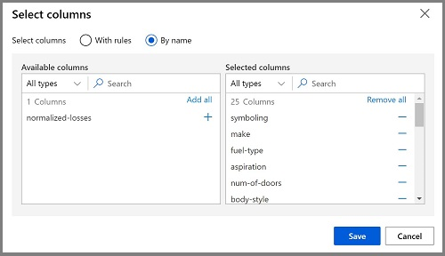
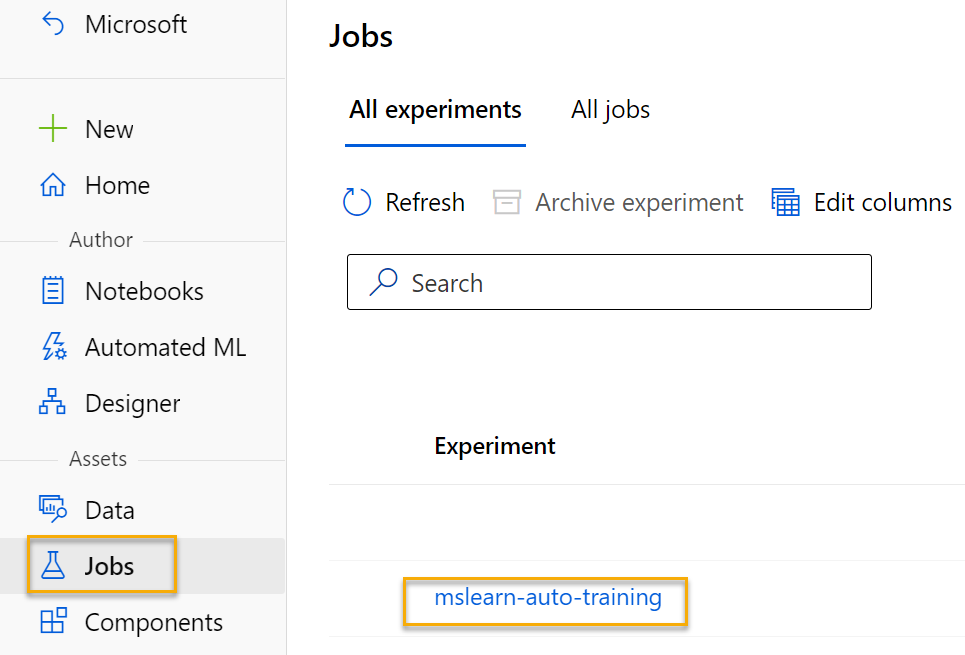
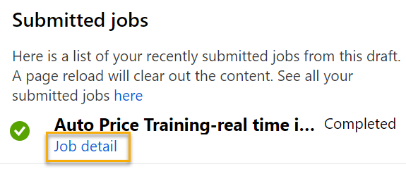

---
lab:
  title: Exploración de la regresión con el diseñador de Azure Machine Learning
---

# <a name="explore-regression-with-azure-machine-learning-designer"></a>Exploración de la regresión con el diseñador de Azure Machine Learning

> **Nota** Para completar este laboratorio, necesitará una [suscripción de Azure](https://azure.microsoft.com/free?azure-portal=true) en la que tenga acceso de administrador.

En este módulo, entrenará un modelo de regresión que predice el precio de un automóvil en función de sus características.

## <a name="create-an-azure-machine-learning-workspace"></a>Creación de un área de trabajo de Azure Machine Learning  

1. Inicie sesión en [Azure Portal](https://portal.azure.com?azure-portal=true) con las credenciales de Microsoft.

1. Seleccione **+Crear un recurso**, busque *Machine Learning* y cree un recurso de **Azure Machine Learning** con un plan *Azure Machine Learning*. Use la configuración siguiente:
    - **Suscripción**: *su suscripción a Azure*.
    - **Grupo de recursos**: *cree o seleccione un grupo de recursos*.
    - **Nombre del área de trabajo**: *escriba un nombre único para el área de trabajo*.
    - **Región**: *seleccione la región geográfica más cercana*.
    - **Cuenta de almacenamiento**: *tenga en cuenta la nueva cuenta de almacenamiento predeterminada que se creará para el área de trabajo*.
    - **Almacén de claves**: *tenga en cuenta el nuevo almacén de claves predeterminado que se creará para el área de trabajo*.
    - **Application Insights**: *tenga en cuenta el nuevo recurso de Application Insights predeterminado que se creará para el área de trabajo*.
    - **Registro de contenedor**: ninguno (*se creará uno automáticamente la primera vez que implemente un modelo en un contenedor*).

1. Seleccione **Revisar y crear** y, luego, **Crear**. Espere a que se cree el área de trabajo (puede tardar unos minutos) y, a continuación, vaya al recurso implementado.

1. Seleccione **Iniciar estudio** (o abra una nueva pestaña del explorador y vaya a [https://ml.azure.com](https://ml.azure.com?azure-portal=true) e inicie sesión en estudio de Azure Machine Learning con su cuenta de Microsoft).

1. En estudio de Azure Machine Learning, debería ver el área de trabajo recién creada. Si no es así, haga clic en **Microsoft** en el menú de la izquierda. A continuación, en el nuevo menú de la izquierda, seleccione **Áreas de trabajo**, donde se muestran todas las áreas de trabajo asociadas a la suscripción. Elija la que creó para este ejercicio. 

> **Nota** Este módulo es uno de los muchos que hacen uso de un área de trabajo Azure Machine Learning, incluidos el resto de módulos de la ruta de aprendizaje[Microsoft Azure AI Fundamentals: exploración de las herramientas visuales para el aprendizaje automático](https://docs.microsoft.com/learn/paths/create-no-code-predictive-models-azure-machine-learning/). Si usa su propia suscripción de Azure, le recomendamos que cree el área de trabajo una vez y la reutilice en otros módulos. A la suscripción de Azure se le cargará un importe reducido por el almacenamiento de datos, siempre y cuando el área de trabajo de Azure Machine Learning exista en la suscripción, por lo que se recomienda eliminar el área de trabajo de Azure Machine Learning cuando ya no sea necesaria.

## <a name="create-compute"></a>Creación del proceso

1. En [estudio de Azure Machine Learning](https://ml.azure.com?azure-portal=true), seleccione las tres líneas de la parte superior izquierda para ver las distintas páginas de la interfaz (es posible que tenga que maximizar el tamaño de la pantalla). Puede usar estas páginas del panel de la izquierda para administrar los recursos del área de trabajo. Vea la página **Proceso** (en **Administrar**).

1. En la página **Proceso**, seleccione la pestaña **Clústeres de proceso** y agregue un clúster de proceso nuevo con la configuración siguiente para entrenar un modelo de Machine Learning:
    - **Ubicación**: *seleccione la misma que el área de trabajo. Si esa ubicación no aparece, elija la más cercana.*
    - **Nivel de máquina virtual**: dedicado
    - **Tipo de máquina virtual**: CPU
    - **Tamaño de la máquina virtual**:
        - Elija **Seleccionar de entre todas las opciones**
        - Busque y seleccione **Standard_DS11_v2**
    - Seleccione **Siguiente**.
    - **Nombre del proceso**: *escriba un nombre único*
    - **Número mínimo de nodos**: 0
    - **Número máximo de nodos**: 2
    - **Segundos de inactividad antes de la reducción vertical**: 120
    - **Habilitar acceso SSH**: Eliminar
    - Seleccione **Crear**

> **Nota** Las instancia de proceso y los clústeres se basan en imágenes de máquina virtual de Azure estándar. Para este módulo, se recomienda la imagen *Standard_DS11_v2* para lograr el equilibrio óptimo entre el costo y el rendimiento. Si la suscripción tiene una cuota que no incluye esta imagen, elija una imagen alternativa, pero tenga en cuenta que una imagen más grande puede incurrir en un costo mayor y una imagen más pequeña puede no ser suficiente para completar las tareas. Como alternativa, pida al administrador de Azure que amplíe la cuota.

El clúster de proceso tardará algún tiempo en crearse. Mientras espera, puede continuar con el siguiente paso.

## <a name="create-a-pipeline-in-designer"></a>Creación de una canalización en el Diseñador 

1. En [Estudio de Azure Machine Learning](https://ml.azure.com?azure-portal=true), expanda el panel izquierdo seleccionando el icono de las tres líneas de la parte superior izquierda de la pantalla. Vea la página **Diseñador** (en **Autor**) y seleccione **+** para crear una canalización.

1. En la parte superior derecha de la pantalla, seleccione **Configuración**. Si el panel **Configuración** no está visible, seleccione el icono de la rueda dentada situado junto al nombre de la canalización en la parte superior.

1. En **Configuración**, tendrá que especificar un destino de proceso en el que ejecutar la canalización. En **Select compute type (Seleccionar tipo de proceso)**, seleccione **Clúster de proceso**. Después, en **Select Azure ML compute cluster (Seleccionar tipo de proceso de Azure ML)** , seleccione el clúster de proceso que creó anteriormente.

1. En **Configuración**, en **Draft Details (Detalles del borrador)** , cambie el nombre del borrador (*Pipeline-Created-on-* date) a **Auto Price Training**.

1. Seleccione el *icono de cierre* en la esquina superior derecha del panel de **Configuración** para cerrarlo. 


## <a name="add-and-explore-a-dataset"></a>Adición y exploración de un conjunto de datos

Azure Machine Learning incluye un conjunto de datos de ejemplo que puede usar para el modelo de regresión.

1. Junto al nombre de la canalización en el lado izquierdo, seleccione el icono de flechas para expandir el panel si está contraído. El panel debería abrirse de forma predeterminada en el **Panel biblioteca**, indicado por el icono de libros situado en la parte superior del panel. Hay una barra de búsqueda para buscar recursos en el panel y dos botones, **Datos** y **Componentes**.

    

1. Haga clic en **Componente**. Busque el conjunto de datos **Datos de precio de automóviles (Sin formato)** y colóquelo en el lienzo.

1. Haga clic con el botón derecho (Ctrl+clic en Mac) en el conjunto de datos **Datos de precio de automóviles (Sin formato)** en el lienzo y haga clic en **Vista previa de los datos**.

1. Revise el esquema *Salida del conjunto de datos* de los datos y observe que puede ver las distribuciones de las distintas columnas como histogramas.

1. Desplácese a la derecha del conjunto de datos hasta que vea la columna **Price**, que es la etiqueta que predice el modelo.

1. Desplácese de nuevo a la izquierda y seleccione el encabezado de la columna **normalized-losses** (Pérdidas normalizadas). Después, revise las estadísticas de esta columna. Tenga en cuenta que faltan bastantes valores en esta columna. Los valores que faltan limitan la utilidad de la columna para predecir la etiqueta **price**, por lo que es posible que quiera excluirla del entrenamiento.

1. Cierre la ventana **Visualización de los resultados de Automobile price data (Raw)** para poder ver el conjunto de datos en el lienzo de esta forma:

    

## <a name="add-data-transformations"></a>Adición de transformaciones de datos

Normalmente se aplican transformaciones de datos para preparar los datos para el modelado. En el caso de los datos de precios de automóviles, debe agregar transformaciones para solucionar los problemas que ha identificado al explorar los datos.

1. En el panel **Biblioteca de recursos** de la izquierda, haga clic en **Componentes**, que contiene una amplia gama de módulos que puede usar para la transformación de datos y el entrenamiento del modelo. También puede utilizar la barra de búsqueda para localizar los módulos con rapidez.

1. Busque un módulo **Seleccionar columnas del conjunto de datos** y colóquelo en el lienzo, debajo del módulo **Datos de precio de automóviles (Sin formato)**. Después, conecte la salida de la parte inferior del módulo **Automobile price data (Raw)** a la entrada de la parte superior del módulo **Seleccionar columnas del conjunto de datos**, de esta forma:

    

1. Haga doble clic en el módulo **Seleccionar columnas del conjunto de datos** para acceder a un panel de configuración a la derecha. Seleccione **Editar columna**. A continuación, en la ventana **Seleccionar columnas**, seleccione **Por nombre** y **Agregar todo** para agregar todas las columnas. A continuación, quite las **Pérdidas normalizadas**, y la selección de columna final tendrá el siguiente aspecto:

    

1. Haga clic en el botón **Guardar**.

En el resto de este ejercicio, aprenderá paso a paso cómo crear una canalización similar a la siguiente:


Siga los pasos restantes, y use la imagen como referencia a medida que agrega y configura los módulos necesarios.

1. En el panel**Biblioteca de recursos**, busque un módulo **Limpiar datos que faltan** y colóquelo en el módulo **Seleccionar columnas del conjunto de datos** en el lienzo. Después, conecte la salida del módulo **Seleccionar columnas del conjunto de datos** a la entrada del módulo **Limpiar datos que faltan**.

1. Haga doble clic en el módulo **Limpiar datos que faltan** y, en el panel de la derecha, haga clic en **Editar columna**. Después, en la ventana **Columnas para eliminar**, seleccione **Con reglas**, en la lista **Incluir** seleccione **Nombres de columna** y, en el cuadro de nombres de columna, escriba **bore**, **stroke** y **horsepower** de esta forma:

    

1. Con el módulo **Limpiar datos que faltan** seleccionado, en el panel de la derecha, establezca las siguientes opciones de configuración:
    - **Relación mínima de valores que faltan**: 0,0
    - **Relación máxima de valores que faltan**: 1,0
    - **Modo de limpieza**: quitar toda la fila

    >**Consejo** Si ve las estadísticas para las columnas **bore**, **stroke**, y **horsepower**, verá un número de valores que faltan. Estas columnas tienen menos valores que faltan que **normalized-losses**, por lo que pueden seguir siendo útiles para predecir el valor **price** cuando se excluyan del entrenamiento las filas en las que faltan valores.

1. En el **Panel biblioteca**, busque un módulo **Normalizar datos** y colóquelo en el lienzo, debajo del módulo **Limpiar datos que faltan**. Después, conecte la salida del módulo **Limpiar datos que faltan** a la entrada del módulo **Normalizar datos**.

1. Haga doble clic en el módulo **Normalizar datos** para ver su panel de parámetros. Tendrá que especificar el método de transformación y las columnas que se van a transformar. Establezca la transformación en **MinMax**. Aplique una regla; para ello, seleccione **Editar columna** para incluir los siguientes **Nombres de columna**:
    - **symboling**
    - **wheel-base**
    - **length**
    - **width**
    - **height**
    - **curb-weight**
    - **engine-size**
    - **bore**
    - **stroke**
    - **compression-ratio**
    - **horsepower**
    - **peak-rpm**
    - **city-mpg**
    - **highway-mpg**

    

    >**Consejo** Si compara los valores de las columnas **stroke**, **peak-rpm**, y **city-mpg** todas se miden en diferentes escalas y es posible que los valores más grandes para **peak-rpm** puedan sesgar el algoritmo y crear una dependencia excecsiva en esta columna, en comparación con las columnas de valores inferiores, como **stroke**. Normalmente, los científicos de datos mitigan este posible sesgo mediante la *normalización* de las columnas numéricas para que estén en escalas similares.

## <a name="run-the-pipeline"></a>Ejecución de la canalización

Para aplicar las transformaciones de datos, debe ejecutar la canalización.

1. Asegúrese de que la canalización sea similar a esta imagen:

    

1. Seleccione **Enviar**y cree un nuevo experimento denominado **mslearn-auto-training** en el clúster de proceso.

1. Espere a que finalice la ejecución, lo que puede tardar 5 minutos o más.

    

    Observe que el panel izquierdo está ahora en el panel **Trabajos enviados**. Sabrá cuándo se completa la ejecución porque el estado del trabajo cambiará a **Completado**. 

1. Una vez completada la ejecución, haga clic en **Detalles del trabajo**. Se abrirá una nueva pestaña y verá los componentes que se han completado con marcas de verificación como esta:

    

Ahora el conjunto de datos está preparado para el entrenamiento del modelo. Cierre la ventana Detalles del trabajo para volver a la canalización.

## <a name="create-training-pipeline"></a>Creación de una canalización de entrenamiento

Después de haber usado transformaciones de datos para preparar los datos, puede usarlos para entrenar un modelo de Machine Learning. Siga estos pasos para ampliar la canalización **Auto Price Training**.

1. Vuelva a la canalización **Entrenamiento de precios automático** que ha creado en la unidad anterior si todavía no está abierta.

1. En el panel**Biblioteca** de la izquierda, busque y coloque un módulo **Dividir datos** en el lienzo debajo del módulo **Normalizar datos**. Después, conecte la salida *Conjunto de datos transformado* (izquierda) del módulo **Normalizar los datos** a la entrada del módulo **Dividir datos**.

    >**Consejo** Use la barra de búsqueda para localizar los módulos con rapidez. 

1. Seleccione el módulo **Dividir datos** y configure sus valores como se indica a continuación:
    * **Modo de división**: dividir filas
    * **Fracción de filas del primer conjunto de datos de salida**: 0,7
    * **División aleatoria**: True
    * **Valor de inicialización aleatorio**: 123
    * **División estratificada**: falso

1. En el panel **Biblioteca de recursos**, busque y coloque un módulo **Entrenar modelo** en el lienzo, en el módulo **Dividir datos**. Después, conecte la salida de *Conjunto de datos de resultados 1* (izquierda) del módulo **Dividir datos** a la entrada *Conjunto de datos* (derecha) del módulo **Entrenar modelo**.

1. El modelo que va a entrenar predecirá el valor de **price**, por lo que debe seleccionar el módulo **Entrenar modelo** y modificar su configuración para establecer la **columna Etiqueta** en **price** (con la misma ortografía y mayúsculas y minúsculas).

    La etiqueta **price** que predecirá el modelo es un valor numérico, por lo que es necesario entrenar el modelo mediante un algoritmo de *regresión*.

1. En el panel **Biblioteca de recursos**, busque y coloque un módulo **Regresión lineal** en el lienzo, a la izquierda del módulo **Dividir datos** y por encima del módulo **Entrenar modelo**. Después, conecte su salida a la entrada **Modelo no entrenado** (izquierda) del módulo **Entrenar modelo**.

    > **Nota** Puede usar varios algoritmos para entrenar un modelo de regresión. Para ayudarle a elegir uno, eche un vistazo a la [Hoja de referencia rápida de algoritmos de aprendizaje automático del diseñador de Azure Machine Learning](https://aka.ms/mlcheatsheet?azure-portal=true).

    Para probar el modelo entrenado, es necesario usarlo para *puntuar* el conjunto de datos de validación que se ha conservado al dividir los datos originales, es decir, para predecir las etiquetas de las características del conjunto de datos de validación.
 
1. En el panel **Biblioteca de recursos**, busque y coloque un módulo **Puntuar modelo** en el lienzo, debajo del módulo **Entrenar modelo**. Después, conecte la salida del módulo **Entrenar modelo** a la entrada **Modelo entrenado** (izquierda) del módulo **Puntuar modelo** y arrastre la salida **Conjunto de datos de resultados 2** (derecha) del módulo **Dividir datos** a la entrada **Conjunto de datos** (derecha) del módulo **Puntuar modelo**.

1. Asegúrese de que la canalización es similar a la imagen siguiente:

    

## <a name="run-the-training-pipeline"></a>Ejecución de la canalización de entrenamiento

Ya está a punto para ejecutar la canalización de entrenamiento y entrenar el modelo.

1. Seleccione **Enviar** y ejecute la canalización mediante el experimento existente denominado **mslearn-auto-training**.

1. La ejecución del experimento tardará 5 minutos o más en completarse. Cuando se haya completado la ejecución del experimento, seleccione **Detalles del trabajo**. Se le redirigirá a una nueva pestaña.

1. En la nueva ventana, haga clic con el botón derecho en el módulo **Puntuar modelo** y seleccione **Vista previa de los datos** y, a continuación, en **Conjunto de datos puntuado** para ver los resultados.

1. Desplácese a la derecha y observe que junto a la columna **price** (que contiene los valores reales conocidos de la etiqueta) hay una nueva columna denominada **Etiquetas puntuadas**, que contiene los valores de etiqueta pronosticados.

1. Cierre la pestaña**Score Model result visualization*** (Visualización del resultado de Puntuar modelo).

El modelo predice valores para la etiqueta **price**, ¿pero qué fiabilidad tienen sus predicciones? Para valorarlo, tendrá que evaluar el modelo.

## <a name="evaluate-model"></a>Evaluación de modelo

Una manera de evaluar un modelo de regresión es comparar las etiquetas previstas con las etiquetas reales del conjunto de datos de validación que se mantiene durante el entrenamiento. Otra manera es comparar el rendimiento de varios modelos.

1. Abra la canalización **Auto Price Training** que ha creado.

1. En el panel **Biblioteca de recursos**, busque y coloque un módulo **Evaluar modelo** al lienzo bajo el módulo **Puntuar modelo**, y conecte la salida del módulo **Puntuar modelo** a la entrada **Puntuación de conjunto de datos** (izquierda) del módulo **Evaluar modelo**.

1. Asegúrese de que la canalización es similar a la siguiente:

    

1. Seleccione **Enviar** y ejecute la canalización mediante el experimento existente denominado **mslearn-auto-training**.

1. Espere a que se complete la ejecución del experimento.

    

1. Cuando se haya completado la ejecución del experimento, seleccione **Detalles del trabajo**, que abrirá otra pestaña. Busque y haga clic con el botón derecho en el módulo **Evaluar modelo**. Seleccione **Vista previa de los datos** y, a continuación, **Resultados de evaluación**.

    

1. En el panel *Evaluation_results*, revise las métricas de rendimiento de la regresión:
    - **Error medio absoluto (MAE)**
    - **Raíz del error cuadrático medio (RMSE)**
    - **Error cuadrático relativo (RSE)**
    - **Error absoluto relativo (RAE)**
    - **Coeficiente de determinación (R<sup>2</sup>)**
1. Cierre el panel *Evaluation_results*.

Cuando haya identificado un modelo con métricas de evaluación que se ajusten a las necesidades, puede prepararse para usar ese modelo con nuevos datos.

## <a name="create-and-run-an-inference-pipeline"></a>Creación y ejecución de una canalización de inferencia

1. En Estudio de Azure Machine Learning, expanda el panel izquierdo seleccionando las tres líneas de la parte superior izquierda de la pantalla. Haga clic en **Trabajos** (en **Activos**) para ver todos los trabajos que ha ejecutado. Seleccione el experimento **mslearn-auto-training** y, después, la canalización **mslearn-auto-training**. 

    

1. Busque el menú situado encima del lienzo y haga clic en **Create inference pipeline (Crear canalización de inferencia)**. Es posible que tenga que acceder a la pantalla completa y hacer clic en el icono de tres puntos **...** en la esquina superior derecha de la pantalla para buscar **Create inference pipeline (Crear canalización de inferencia)** en el menú.  

    

1. En la lista desplegable **Crear canalización de inferencia**, haga clic en **Canalización de inferencia en tiempo real**. Después de unos segundos, se abrirá una versión nueva de la canalización denominada **Entrenamiento de precios automático-inferencia en tiempo real**.

    *Si la canalización no incluye los módulos**Entrada de servicio web** y **Salida de servicio web**, vuelva a la página **Diseñador** y, después, abra de nuevo la canalización **Entrenamiento de precios automático-inferencia en tiempo real**.*

1. Cambie el nombre de la nueva canalización a **Predicción de precios automática** y después revísela. Contiene una entrada de servicio web para los nuevos datos que se van a enviar y una salida de servicio web para devolver los resultados. Algunas de las transformaciones y los pasos de entrenamiento forman parte de esta canalización. El modelo entrenado se usará para puntuar los nuevos datos.

    Va a realizar los cambios siguientes en la canalización de inferencia en los pasos 5 a 9 siguientes:

    

   Use la imagen como referencia a medida que modifique la canalización en los pasos siguientes.

1. La canalización de inferencia supone que los datos nuevos coincidirán con el esquema de los datos de entrenamiento originales, por lo que se incluye el conjunto de datos **Automobile price data (Raw)** de la canalización de entrenamiento. Pero estos datos de entrada incluyen la etiqueta **price** que predice el modelo, lo que no resulta intuitivo incluir en los nuevos datos de automóvil para los que todavía no se ha realizado una predicción del precio. Elimine este módulo y reemplácelo por un módulo **Escribir los datos manualmente** de la sección **Entrada y salida de datos**, que contiene los siguientes datos CSV, que incluyen valores de características sin etiquetas para tres automóviles (copie y pegue todo el bloque de texto):

    ```CSV
    symboling,normalized-losses,make,fuel-type,aspiration,num-of-doors,body-style,drive-wheels,engine-location,wheel-base,length,width,height,curb-weight,engine-type,num-of-cylinders,engine-size,fuel-system,bore,stroke,compression-ratio,horsepower,peak-rpm,city-mpg,highway-mpg
    3,NaN,alfa-romero,gas,std,two,convertible,rwd,front,88.6,168.8,64.1,48.8,2548,dohc,four,130,mpfi,3.47,2.68,9,111,5000,21,27
    3,NaN,alfa-romero,gas,std,two,convertible,rwd,front,88.6,168.8,64.1,48.8,2548,dohc,four,130,mpfi,3.47,2.68,9,111,5000,21,27
    1,NaN,alfa-romero,gas,std,two,hatchback,rwd,front,94.5,171.2,65.5,52.4,2823,ohcv,six,152,mpfi,2.68,3.47,9,154,5000,19,26
    ```

1. Conecte el nuevo módulo **Escribir los datos manualmente** a la misma entrada **conjunto de datos** del módulo **Seleccionar columnas del conjunto de datos** como **Entrada de servicio web**.

1. Ahora que ha cambiado el esquema de los datos entrantes para excluir el campo** price**, tendrá que quitar todos los usos explícitos de este campo en los módulos restantes. Seleccione el módulo **Seleccionar columnas del conjunto de datos** y, después, en el panel Configuración, edite las columnas para quitar el campo **price**.

1. La canalización de inferencia incluye el módulo **Evaluar modelo**, que no resulta útil al realizar predicciones a partir de los datos nuevos, por lo que puede eliminarlo.

1. En la salida del módulo **Puntuar modelo** se incluyen todas las características de entrada y la etiqueta predicha. Para modificar la salida de forma que solo incluya la predicción:
    - Elimine la conexión entre el módulo **Puntuar modelo** y **Salida de servicio web**.
    - Agregue un módulo **Ejecutar script de Python** desde la sección **Python Language (Lenguaje Python)** y reemplace todo el script de Python predeterminado por el código siguiente (que solo selecciona la columna **Scored Labels** y le cambia el nombre por **predicted_price**):

```Python
import pandas as pd

def azureml_main(dataframe1 = None, dataframe2 = None):

    scored_results = dataframe1[['Scored Labels']]
    scored_results.rename(columns={'Scored Labels':'predicted_price'},
                        inplace=True)
    return scored_results
```

    - Conecte la salida del módulo **Puntuar modelo** a la entrada **Conjunto de datos 1** (en el extremo izquierdo) del módulo **Ejecutar script de Python**, y conecte la salida del módulo **Ejecutar script de Python** a **Salida del servicio web**.

1. Compruebe que la canalización tiene un aspecto similar a la imagen siguiente:

    

1. Envíe la canalización como un nuevo experimento denominado **mslearn-auto-inference** en el clúster de proceso. El experimento puede tardar un tiempo en ejecutarse.

1. Cuando se haya completado la canalización, seleccione **Detalles del trabajo**. En la nueva pestaña, haga clic con el botón derecho en el módulo **Ejecutar script de Python**. Seleccione **Vista previa de datos** y luego **Conjunto de datos de resultado** para ver los precios previstos de los tres automóviles en los datos de entrada.

1. A continuación, cierre la pstaña de visualización.

La canalización de inferencia predice los precios de los automóviles en función de sus características. Ya está a punto para publicar la canalización a fin de que las aplicaciones cliente la puedan usar.

## <a name="deploy-model"></a>Implementación de un modelo

Después de crear y probar una canalización de inferencia para la inferencia en tiempo real, puede publicarla como un servicio para que lo usen las aplicaciones cliente.

> **Nota** En este ejercicio, implementará el servicio web en una instancia de Azure Container (ACI). Este tipo de proceso se crea dinámicamente y resulta útil para el desarrollo y las pruebas. Para producción, debe crear un *clúster de inferencia*, que proporciona un clúster de Azure Kubernetes Service (AKS) que ofrece mejor escalabilidad y seguridad.

## <a name="deploy-a-service"></a>Implementación de un servicio

1. Vea la canalización de inferencia **Predicción de precios automática** que ha creado en la unidad anterior.

1. Seleccione **Detalles del trabajo** en el panel izquierdo, lo que abrirá una segunda pestaña.

    

1. En la nueva pestaña, seleccione **Implementar**.

    

1. En la pantalla de configuración, seleccione **Implementar un nuevo punto de conexión en tiempo real** con la siguiente configuración:
    -  **Nombre**: predict-auto-price
    -  **Descripción**: regresión de precios automática.
    - **Tipo de proceso**: instancia de Azure Container.

1. Espere unos minutos para que se implemente el servicio web. El estado de implementación se muestra en la parte superior izquierda de la interfaz del diseñador.

## <a name="test-the-service"></a>Probar el servicio

1. En la página **Puntos de conexión**, abra el punto de conexión en tiempo real **predict-auto-price**.

    

1. Cuando se abra el punto de conexión **predict-auto-price**, seleccione la pestaña **Prueba**. Lo usaremos para probar el modelo con nuevos datos. Elimine los datos actuales en **Datos de entrada para probar el punto de conexión en tiempo real**. Copie y pegue los datos siguientes en la sección de datos:  

    ```json
    {
    "Inputs": {
                "WebServiceInput0":
                [
                    {
                        "symboling": 3,
                        "normalized-losses": 1.0,
                        "make": "alfa-romero",
                        "fuel-type": "gas",
                        "aspiration": "std",
                        "num-of-doors": "two",
                        "body-style": "convertible",
                        "drive-wheels": "rwd",
                        "engine-location": "front",
                        "wheel-base": 88.6,
                        "length": 168.8,
                        "width": 64.1,
                        "height": 48.8,
                        "curb-weight": 2548,
                        "engine-type": "dohc",
                        "num-of-cylinders": "four",
                        "engine-size": 130,
                        "fuel-system": "mpfi",
                        "bore": 3.47,
                        "stroke": 2.68,
                        "compression-ratio": 9,
                        "horsepower": 111,
                        "peak-rpm": 5000,
                        "city-mpg": 21,
                        "highway-mpg": 27
                    }
                ]
            },
    "GlobalParameters": {}
    }
    ```

1. Seleccione **Probar**. En la parte derecha de la pantalla, debería ver la salida **"predicted_price"**. La salida es el precio previsto para un vehículo con las características de entrada concretas especificadas en los datos. 

    

Revisemos lo que ha hecho. Ha limpiado y transformado un conjunto de datos de automóviles y, a continuación, ha usado las *características* del automóvil para entrenar un modelo. El modelo predice el precio de un automóvil, que es la *etiqueta*.

También ha probado un servicio que está listo para conectarse a una aplicación cliente mediante las credenciales de la pestaña **Consumir**. Terminaremos el laboratorio aquí. Si lo desea, puede seguir experimentando con el servicio que acaba de implementar.

## <a name="clean-up"></a>Limpieza

El servicio web que se ha creado se hospeda en una *instancia de Azure Container*. Si no tiene previsto experimentar con él, debe eliminar el punto de conexión para evitar el uso innecesario de Azure. También debe detener la instancia de proceso hasta que la vuelva a necesitar.

1. En [Azure Machine Learning Studio](https://ml.azure.com?azure-portal=true), en la pestaña **Puntos de conexión**, seleccione el punto de conexión **predict-auto-price**. A continuación, seleccione **Eliminar** y confirme que quiere eliminar el punto de conexión.

1. En la página **Proceso**, en la pestaña **Instancias de proceso**, seleccione su instancia de proceso y, luego, **Eliminar**.

>**Nota** Al detener el proceso, garantiza que no se cobren los recursos de proceso en la suscripción. Sin embargo, se le cobrará un importe reducido por el almacenamiento de datos, siempre que el área de trabajo de Azure Machine Learning exista en la suscripción. Si ha terminado de explorar Azure Machine Learning, puede eliminar el área de trabajo de Azure Machine Learning y los recursos asociados. Sin embargo, si planea completar cualquier otro laboratorio de esta serie, tendrá que volver a crearla.
>
> Para eliminar el área de trabajo:
>
> 1. En [Azure Portal](https://portal.azure.com?azure-portal=true), en la página **Grupos de recursos**, abra el grupo de recursos que haya especificado al crear el área de trabajo de Azure Machine Learning.
> 1. Haga clic en **Eliminar grupo de recursos**, escriba el nombre del grupo de recursos para confirmar que quiere eliminarlo y seleccione **Eliminar**.
