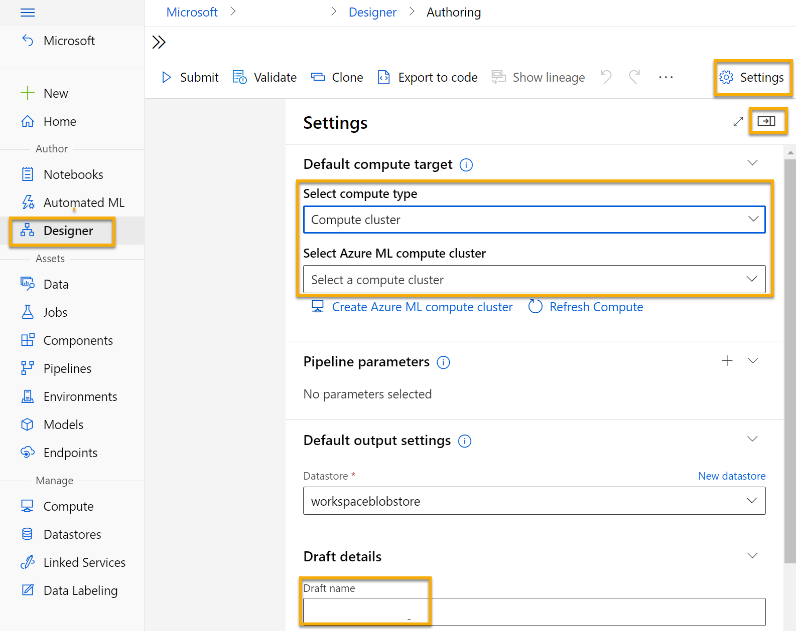
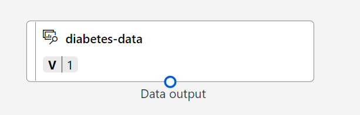
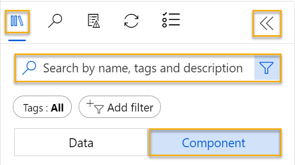

---
lab:
  title: Exploración de la clasificación con el diseñador de Azure Machine Learning
---

# <a name="explore-classification-with-azure-machine-learning-designer"></a>Exploración de la clasificación con el diseñador de Azure Machine Learning

> **Nota** Para completar este laboratorio, necesitará una [suscripción de Azure](https://azure.microsoft.com/free?azure-portal=true) en la que tenga acceso de administrador.

## <a name="create-an-azure-machine-learning-workspace"></a>Creación de un área de trabajo de Azure Machine Learning  

1. Inicie sesión en [Azure Portal](https://portal.azure.com?azure-portal=true) con las credenciales de Microsoft.

1. Seleccione **+Crear un recurso**, busque *Machine Learning* y cree un recurso de **Azure Machine Learning** con un plan *Azure Machine Learning*. Use la configuración siguiente:
    - **Suscripción**: *su suscripción a Azure*.
    - **Grupo de recursos**: *cree o seleccione un grupo de recursos*.
    - **Nombre del área de trabajo**: *escriba un nombre único para el área de trabajo*.
    - **Región**: *seleccione la región geográfica más cercana*.
    - **Cuenta de almacenamiento**: *tenga en cuenta la nueva cuenta de almacenamiento predeterminada que se creará para el área de trabajo*.
    - **Almacén de claves**: *tenga en cuenta el nuevo almacén de claves predeterminado que se creará para el área de trabajo*.
    - **Application Insights**: *tenga en cuenta el nuevo recurso de Application Insights predeterminado que se creará para el área de trabajo*.
    - **Registro de contenedor**: ninguno (*se creará uno automáticamente la primera vez que implemente un modelo en un contenedor*).

1. Seleccione **Revisar y crear** y, luego, **Crear**. Espere a que se cree el área de trabajo (puede tardar unos minutos) y, a continuación, vaya al recurso implementado.

1. Seleccione **Iniciar estudio** (o abra una nueva pestaña del explorador y vaya a [https://ml.azure.com](https://ml.azure.com?azure-portal=true) e inicie sesión en estudio de Azure Machine Learning con su cuenta de Microsoft).

1. En estudio de Azure Machine Learning, debería ver el área de trabajo recién creada. Si no es así, haga clic en **Microsoft** en el menú de la izquierda. A continuación, en el nuevo menú de la izquierda, seleccione **Áreas de trabajo**, donde se muestran todas las áreas de trabajo asociadas a la suscripción. Elija la que creó para este ejercicio. 

> **Nota** Este módulo es uno de los muchos que hacen uso de un área de trabajo Azure Machine Learning, incluidos el resto de módulos de la ruta de aprendizaje[Microsoft Azure AI Fundamentals: exploración de las herramientas visuales para el aprendizaje automático](https://docs.microsoft.com/learn/paths/create-no-code-predictive-models-azure-machine-learning/). Si usa su propia suscripción de Azure, le recomendamos que cree el área de trabajo una vez y la reutilice en otros módulos. A la suscripción de Azure se le cargará un importe reducido por el almacenamiento de datos, siempre y cuando el área de trabajo de Azure Machine Learning exista en la suscripción, por lo que se recomienda eliminar el área de trabajo de Azure Machine Learning cuando ya no sea necesaria.

## <a name="create-compute"></a>Creación del proceso

1. En [estudio de Azure Machine Learning](https://ml.azure.com?azure-portal=true), seleccione las tres líneas de la parte superior izquierda para ver las distintas páginas de la interfaz (es posible que tenga que maximizar el tamaño de la pantalla). Puede usar estas páginas del panel de la izquierda para administrar los recursos del área de trabajo. Vea la página **Proceso** (en **Administrar**).

1. En la página **Proceso**, seleccione la pestaña **Clústeres de proceso** y agregue un clúster de proceso nuevo con la configuración siguiente. Lo usará para entrenar un modelo de Machine Learning:
    - **Ubicación**: *seleccione la misma que el área de trabajo. Si esa ubicación no aparece, elija la más cercana.*
    - **Nivel de máquina virtual**: dedicado
    - **Tipo de máquina virtual**: CPU
    - **Tamaño de la máquina virtual**:
        - Elija **Seleccionar de entre todas las opciones**
        - Busque y seleccione **Standard_DS11_v2**
    - Seleccione **Siguiente**.
    - **Nombre del proceso**: *escriba un nombre único*.
    - **Número mínimo de nodos**: 0
    - **Número máximo de nodos**: 2
    - **Segundos de inactividad antes de la reducción vertical**: 120
    - **Habilitar acceso SSH**: Eliminar
    - Seleccione **Crear**

> **Nota** Las instancia de proceso y los clústeres se basan en imágenes de máquina virtual de Azure estándar. Para este módulo, se recomienda la imagen *Standard_DS11_v2* para lograr el equilibrio óptimo entre el costo y el rendimiento. Si la suscripción tiene una cuota que no incluye esta imagen, elija una imagen alternativa, pero tenga en cuenta que una imagen más grande puede incurrir en un costo mayor y una imagen más pequeña puede no ser suficiente para completar las tareas. Como alternativa, pida al administrador de Azure que amplíe la cuota.

El clúster de proceso tardará algún tiempo en crearse. Mientras espera, puede continuar con el siguiente paso.

## <a name="create-a-pipeline-in-designer"></a>Creación de una canalización en el Diseñador

Para empezar a trabajar con el diseñador de Azure Machine Learning, primero debe crear una canalización y agregar el conjunto de datos con el que quiere trabajar.

1. En [Estudio de Azure Machine Learning](https://ml.azure.com?azure-portal=true), expanda el panel izquierdo seleccionando las tres líneas de la parte superior izquierda de la pantalla. Vea la página **Diseñador** (en **Autor**) y seleccione **+** para crear una canalización.

1. En la parte superior derecha de la pantalla, seleccione **Configuración**. Si el panel **Configuración** no está visible, seleccione el icono de la rueda dentada situado junto al nombre de la canalización en la parte superior.

1. En **Configuración**, tendrá que especificar un destino de proceso en el que ejecutar la canalización. En **Select compute type (Seleccionar tipo de proceso)**, seleccione **Clúster de proceso**. Después, en **Select Azure ML compute cluster (Seleccionar tipo de proceso de Azure ML)** , seleccione el clúster de proceso que creó anteriormente.

1. En **Configuración**, en **Draft Details (Detalles del borrador)** , cambie el nombre del borrador (**Pipeline-Created-on-* date***) a **Diabetes Training**.

1. Seleccione el icono de cierre en la esquina superior derecha del panel **Configuración** para cerrar el panel y, a continuación, seleccione **Guardar**.

    

## <a name="create-a-dataset"></a>Crear un conjunto de datos

1. En [Estudio de Azure Machine Learning](https://ml.azure.com?azure-portal=true), expanda el panel izquierdo seleccionando las tres líneas de la parte superior izquierda de la pantalla. Vea la página **Datos** (en **Activos**). La página Datos contiene archivos de datos o tablas específicos con los que tiene previsto trabajar en Azure Machine Learning. También puede crear conjuntos de datos desde esta página.

1. En la página **Datos**, en la pestaña **Recursos de datos**, seleccione **Crear**. A continuación, configure un recurso de datos con las siguientes opciones:
    * **Tipo de datos**:
        * **Nombre**: diabetes-data
        * **Descripción**: datos de diabetes
        * **Tipo de conjunto de datos**: tabular
    * **Origen de datos**: desde archivos web
    * **Dirección URL web**: 
        * **Dirección URL web**: https://aka.ms/diabetes-data
        * **Omitir validación de datos**: *no seleccionar*.
    * **Configuración**:
        * **Formato de archivo**: delimitado
        * **Delimitador**: coma
        * **Codificación**: UTF-8
        * **Encabezados de columna**: solo el primer archivo tiene encabezados
        * **Omitir filas**: ninguno
        * **Dataset contains multi-line data (El conjunto de datos contiene datos de varias líneas)**: *no seleccionar*
    * **Esquema**:
        * incluir todas las columnas que no sean **Ruta de acceso**
        * Revisar los tipos detectados automáticamente
    * **Revisar**
        * Seleccione **Crear**

1. Después de crear el conjunto de datos, ábralo y vea la página **Explorar** para obtener una muestra de los datos. Estos datos representan detalles de los pacientes que se han sometido a pruebas de diabetes.

### <a name="load-data-to-canvas"></a>Carga de datos al lienzo

1. Vuelva a la canalización seleccionando **Diseñador** en el menú de la izquierda. En la página **Diseñador**, seleccione la canalización **Diabetes Training** .

1. A continuación, en el proyecto, junto al nombre de la canalización de la izquierda, seleccione el icono de flechas para expandir el panel si está contraído. El panel debería abrirse de forma predeterminada en el **Panel biblioteca**, indicado por el icono de libros situado en la parte superior del panel. Tenga en cuenta que hay una barra de búsqueda para buscar activos. Encontrará dos botones: **Datos** y **Componentes**.

    

1. Haga clic en **Datos**. Busque y coloque el conjunto de datos **diabetes-data** en el lienzo.

1. Haga clic con el botón derecho (Ctrl+clic en Mac) en el conjunto de datos **diabetes-data** en el lienzo y haga clic en **Vista previa de los datos**.

1. Revise el esquema de los datos en la pestaña *Perfil* y observe que puede ver las distribuciones de las distintas columnas como histogramas.

1. Desplácese hacia abajo y seleccione el encabezado de la columna **Diabetic**; observe que contiene dos valores **0** y **1**. Estos valores representan las dos clases posibles para la *etiqueta* que el modelo va a predecir; el valor de **0** significa que el paciente no tiene diabetes y el valor de **1** que el paciente es diabético.

1. Desplácese hacia arriba y revise las demás columnas, que representan las *características* que se usarán para predecir la etiqueta. Observe que la mayoría de estas columnas son numéricas, pero cada característica se encuentra en su propia escala. Por ejemplo, los valores de **Age** oscilan entre 21 y 77, mientras que los valores de **DiabetesPedigree** lo hacen entre 0,078 y 2,3016. Al entrenar un modelo de Machine Learning, a veces es posible que los valores más grandes dominen la función de predicción resultante, lo que reduce la influencia de las características que se expresan en una escala menor. Normalmente, los científicos de datos mitigan este posible sesgo mediante la *normalización* de las columnas numéricas para que estén en escalas similares.

1. Cierre la ventana **Visualización de los resultados de diabetes-data** para poder ver el conjunto de datos en el lienzo de esta forma:

    

## <a name="add-transformations"></a>Agregar transformaciones

Para poder entrenar un modelo, normalmente es necesario aplicar algunas transformaciones de preprocesamiento a los datos.

1. En el panel **Biblioteca de recursos** de la izquierda, haga clic en **Componentes**, que contiene una amplia gama de módulos que puede usar para la transformación de datos y el entrenamiento del modelo. También puede utilizar la barra de búsqueda para localizar los módulos con rapidez.

    

1. Localice un módulo **Normalizar datos** y arrástrelo al lienzo, debajo del conjunto de datos **diabetes-data**. Después, conecte la salida de la parte inferior del conjunto de datos **diabetes-data** a la entrada de la parte superior del módulo **Normalizar datos**, como se muestra a continuación:

    

1. Haga doble clic en el módulo **Normalizar datos** y vea su configuración; recuerde que tendrá que especificar el método de transformación y las columnas que se van a transformar. 

1. Establezca el *Método de transformación* a **MinMax** y *Usar 0 para columnas constantes cuando se activa* a **True**. Edite las columnas para incluir las columnas siguientes por nombre, como se muestra en la imagen:
    - **Pregnancies**
    - **PlasmaGlucose**
    - **DiastolicBloodPressure**
    - **TricepsThickness**
    - **SerumInsulin**
    - **BMI**
    - **DiabetesPedigree**
    - **Age**

    

La transformación de datos normaliza las columnas numéricas para colocarlas en la misma escala, lo que ayuda a evitar que las que tienen valores grandes dominen el entrenamiento del modelo. Normalmente aplicaría un conjunto completo de transformaciones de preprocesamiento como este a fin de preparar los datos para el entrenamiento, pero en este ejercicio se simplificará el proceso.

## <a name="run-the-pipeline"></a>Ejecución de la canalización

Para aplicar las transformaciones de datos, debe ejecutar la canalización como un experimento.

1. Seleccione **Enviar** y ejecute la canalización como un nuevo experimento denominado **mslearn-diabetes-training** en el clúster de proceso.

1. Espere unos minutos hasta que finalice la ejecución.

    

    Observe que el panel izquierdo está ahora en el panel **Trabajos enviados**. Sabrá cuándo se completa la ejecución porque el estado del trabajo cambiará a **Completado**.

## <a name="view-the-transformed-data"></a>Visualización de los datos transformados

1. Una vez completada la ejecución, el conjunto de datos ya está preparado para el entrenamiento del modelo. Haga clic en **Detalles del trabajo**. Se le redirigirá a una nueva pestaña.

1. Haga clic con el botón derecho (Ctrl+clic en Mac) en el módulo **Normalizar datos** del lienzo y haga clic en **Vista previa de los datos**. Seleccione **Conjunto de datos transformado**.

1. Vea los datos y tenga en cuenta que las columnas numéricas seleccionadas se han normalizado a una escala común.

1. Cierre la visualización del resultado normalizado de los datos. Volver a la pestaña anterior.

Después de haber usado transformaciones de datos para preparar los datos, puede usarlos para entrenar un modelo de Machine Learning.

## <a name="add-training-modules"></a>Adición de módulos de entrenamiento

Es habitual entrenar el modelo con un subconjunto de los datos, a la vez que se retienen algunos con los que probar el modelo entrenado. Esto le permite comparar las etiquetas que predice el modelo con las etiquetas conocidas reales del conjunto de datos original.

En este ejercicio, aprenderá paso a paso cómo ampliar la canalización **Entrenamiento para la diabetes** como se muestra aquí:


Siga estos pasos y use la imagen anterior como referencia a medida que agrega y configura los módulos necesarios.

1. Abra la canalización **Entrenamiento de diabetes** que ha creado en la unidad anterior si todavía no está abierta.

1. En el **Panel biblioteca** de la izquierda, en la sección **Componentes**, busque y coloque un módulo **Dividir datos** en el lienzo debajo del módulo **Normalizar Datos**. Después, conecte la salida *Conjunto de datos transformado* (izquierda) del módulo **Normalizar los datos** a la entrada del módulo **Dividir datos**.

    >**Consejo** Use la barra de búsqueda para localizar los módulos con rapidez.

1. Seleccione el módulo **Dividir datos** y configure sus valores como se indica a continuación:
    * **Modo de división**: dividir filas
    * **Fracción de filas del primer conjunto de datos de salida**: 0,7
    * **División aleatoria**: True
    * **Valor de inicialización aleatorio**: 123
    * **División estratificada**: falso

1. En el panel **Biblioteca de recursos**, busque y coloque un módulo **Entrenar modelo** en el lienzo, en el módulo **Dividir datos**. Después, conecte la salida de *Conjunto de datos de resultados 1* (izquierda) del módulo **Dividir datos** a la entrada *Conjunto de datos* (derecha) del módulo **Entrenar modelo**.

1. El modelo que se va a entrenar predecirá el valor **Diabetic**, por lo que debe seleccionar el módulo **Entrenar modelo** y modificar su configuración para establecer la **columna Etiqueta** en **Diabetic**.

    La etiqueta **Diabetic** que predecirá el modelo es una clase (0 o 1), por lo que es necesario entrenar el modelo mediante un algoritmo de *clasificación*. En concreto, hay dos clases posibles, por lo que se necesita un algoritmo de *clasificación binaria*.

1. En el **Panel biblioteca**, busque y coloque un módulo **Regresión logística de dos clases** en el lienzo, a la izquierda del módulo **Dividir datos** y por encima del módulo **Entrenar modelo**. Después, conecte su salida a la entrada **Modelo no entrenado** (izquierda) del módulo **Entrenar modelo**.

   Para probar el modelo entrenado, es necesario usarlo para *puntuar* el conjunto de datos de validación que se ha conservado al dividir los datos originales, es decir, para predecir las etiquetas de las características del conjunto de datos de validación.

1. En el panel **Biblioteca de recursos**, busque y coloque un módulo **Puntuar modelo** en el lienzo, debajo del módulo **Entrenar modelo**. Después, conecte la salida del módulo **Entrenar modelo** a la entrada **Modelo entrenado** (izquierda) del módulo **Puntuar modelo** y conecte la salida **Conjunto de datos de resultados 2** (derecha) del módulo **Dividir datos** a la entrada **Conjunto de datos** (derecha) del módulo **Puntuar modelo**.

## <a name="run-the-training-pipeline"></a>Ejecución de la canalización de entrenamiento

Ya está a punto para ejecutar la canalización de entrenamiento y entrenar el modelo.

1. Seleccione **Enviar** y ejecute la canalización mediante el experimento existente denominado **mslearn-diabetes-training**.

1. Espere a que finalice la ejecución del experimento. Esto puede tardar cinco minutos o más.

1. Cuando se haya completado la ejecución del experimento, seleccione **Detalles del trabajo**. Se le dirigirá a una nueva pestaña.

1. En la nueva ventana, haga clic con el botón derecho (Ctrl+clic en Mac) en el módulo **Puntuar modelo** en el lienzo y haga clic en **Vista previa de los datos**. Seleccione **Conjunto de datos puntuado** para ver los resultados.

1. Desplácese a la derecha y observe que junto a la columna **Diabetic** (que contiene los valores reales conocidos de la etiqueta) hay una nueva columna denominada **Etiquetas puntuadas**, que contiene los valores de etiqueta pronosticados, y una columna **Probabilidades puntuadas**, que contiene un valor de probabilidad entre 0 y 1. Esto indica la probabilidad de una predicción *positiva*, por lo que las probabilidades mayores que 0,5 dan como resultado una etiqueta de predicción de ***1*** (diabético), mientras que las comprendidas entre 0 y 0,5 dan como resultado una etiqueta de predicción de ***0*** (no diabético).

1. Cierre la pestaña**Score Model result visualization*** (Visualización del resultado de Puntuar modelo).

El modelo predice valores para la etiqueta **Diabetic**, ¿pero qué fiabilidad tienen sus predicciones? Para valorarlo, tendrá que evaluar el modelo.

Los datos de validación que se conservan y usan para puntuar el modelo incluyen los valores conocidos de la etiqueta. Por tanto, para validar el modelo, puede comparar los valores reales de la etiqueta con los que se han previsto al puntuar el conjunto de datos de validación. En función de esta comparación, puede calcular varias métricas que describan el rendimiento del modelo.

## <a name="add-an-evaluate-model-module"></a>Adición de un módulo Evaluar modelo

1. Abra la canalización **Entrenamiento de diabetes** que ha creado antes.

1. En el panel **Biblioteca de recursos**, busque y coloque un módulo **Evaluar modelo** al lienzo bajo el módulo **Puntuar modelo**, y conecte la salida del módulo **Puntuar modelo** a la entrada **Puntuación de conjunto de datos** (izquierda) del módulo **Evaluar modelo**.

1. Asegúrese de que la canalización es similar a la siguiente:

    

1. Seleccione **Enviar** y ejecute la canalización mediante el experimento existente denominado **mslearn-diabetes-training**.

1. Espere a que finalice la ejecución del experimento.

1. Cuando se haya completado la ejecución del experimento, seleccione **Detalles del trabajo**. Se le dirigirá a una nueva pestaña.

1. En la nueva pestaña, haga clic con el botón derecho (Ctrl+clic en Mac) en el módulo **Evaluar modelo** en el lienzo y haga clic en **Vista previa de los datos**. Seleccione **Resultados de evaluación** para ver las métricas de rendimiento. Estas métricas pueden ayudar a los científicos de datos a evaluar el grado de predicción del modelo en función de los datos de validación.

1. Desplácese hacia abajo para ver la *matriz de confusión* del modelo. Observe los recuentos de valores previstos y reales de cada clase posible. 

1. Revise las métricas de la parte izquierda de la matriz de confusión, entre las que se incluyen las siguientes:
    - **Exactitud**: es decir, ¿qué proporción de predicciones de diabetes ha acertado el modelo?
    - **Precisión**: es decir, de todos los pacientes que *el modelo predijo* que tenían diabetes, el porcentaje de veces que el modelo es correcto. 
    - **Coincidencia**: es decir, de todos los pacientes *que realmente tienen* diabetes, ¿cuántos casos de diabetes ha identificado el modelo correctamente?
    - **Puntuación F1**

1. Use el control deslizante **Umbral** situado encima de la lista de métricas. Intente mover el control deslizante de umbral y observe el efecto en la matriz de confusión. Si lo mueve hasta la izquierda (0), la métrica de coincidencia se convierte en 1 y, si lo mueve hasta la derecha (1), la métrica de coincidencia se convierte en 0.

1. Por encima del control deslizante Umbral, fíjese en la **curva ROC** y la métrica **AUC** incluidas con las otras métricas siguientes. Para hacerse una idea de cómo representa esta área el rendimiento del modelo, imagine una línea diagonal recta desde la parte inferior izquierda hasta la parte superior derecha del gráfico ROC. Esto representa el rendimiento esperado si simplemente adivinara o lanzara una moneda para cada paciente: podría esperar que la mitad de los casos sean correctos y la otra mitad fallidos, por lo que el área situada bajo la línea diagonal representa un AUC de 0,5. Si el valor AUC del modelo es superior al de un modelo de clasificación binaria, el modelo funciona mejor que una estimación aleatoria.

1. Cierre la ventana **Visualización del resultado de Evaluar modelo**.

El rendimiento de este modelo no es perfecto, en parte porque solo se han realizado tareas mínimas de ingeniería de características y procesamiento previo. Podría probar otro algoritmo de clasificación, como **Bosque de decisión de dos clases** y comparar los resultados. Puede conectar las salidas del módulo **Dividir datos** a varios módulos **Entrenar modelo** y **Puntuar modelo** y, además, puede conectar un segundo módulo **Puntuar modelo** al módulo **Evaluar modelo** para ver una comparación en paralelo. El objetivo del ejercicio es simplemente presentar la clasificación y la interfaz del diseñador de Azure Machine Learning, no entrenar un modelo perfecto.

## <a name="create-an-inference-pipeline"></a>Creación de una canalización de inferencia

1. En Estudio de Azure Machine Learning, expanda el panel izquierdo seleccionando las tres líneas de la parte superior izquierda de la pantalla. Haga clic en **Trabajos** (en **Activos**) para ver todos los trabajos que ha ejecutado. Seleccione el experimento **mslearn-diabetes-training** y, después, la canalización **Diabetes Training**.

1. Busque el menú situado encima del lienzo y haga clic en **Create inference pipeline (Crear canalización de inferencia)**. Es posible que tenga que acceder a la pantalla completa y hacer clic en el icono de tres puntos **...** en la esquina superior derecha de la pantalla para buscar **Create inference pipeline (Crear canalización de inferencia)** en el menú.  

    

1. En la lista desplegable **Crear canalización de inferencia**, haga clic en **Canalización de inferencia en tiempo real**. Después de unos segundos, se abrirá una versión nueva de la canalización denominada **Entrenamiento de diabetes-inferencia en tiempo real**.

1. Vaya a **Configuración** en el menú superior derecho. En **Detalles del borrador**, cambie el nombre de la nueva canalización a **Predict Diabetes** y después revísela. Algunas de las transformaciones y los pasos de entrenamiento forman parte de esta canalización. El modelo entrenado se usará para puntuar los nuevos datos. La canalización también contiene una salida de servicio web para devolver resultados. 

    Va a realizar los cambios siguientes en la canalización de inferencia:

    
    
    - Agregue un componente de **entrada de servicio web** para que se envíen nuevos datos.
    - Reemplace el conjunto de datos **diabetes-data** por un módulo **Escribir manualmente los datos** que no incluya la columna de etiqueta (**Diabetic**).
    - Quite el módulo **Evaluar modelo**.
    - Inserte un módulo **Ejecutar script de Python** antes de la salida del servicio web para devolver solo el id. del paciente, la etiqueta pronosticada y la probabilidad.

1. La canalización no incluye automáticamente un componente **de entrada de servicio web** para los modelos creados a partir de conjuntos de datos personalizados. Busque un componente **de entrada de servicio web** desde la biblioteca de recursos y colóquelo en la parte superior de la canalización. Conecte la salida del componente **Entrada de servicio web** a la entrada del lado derecho del componente **Aplicar transformación** que ya está en el lienzo.

1. La canalización de inferencia supone que los datos nuevos coincidirán con el esquema de los datos de entrenamiento originales, por lo que se incluye el conjunto de datos **diabetes-data** de la canalización de entrenamiento. Pero estos datos de entrada incluyen la etiqueta **Diabetic** que predice el modelo, que no se incluye en los nuevos datos de pacientes para los que todavía no se ha realizado una predicción de la diabetes. Elimine este módulo y reemplácelo por un módulo **Escribir los datos manualmente**, que contiene los siguientes datos CSV, que incluyen valores de características sin etiquetas para tres nuevos pacientes:

    ```CSV
    PatientID,Pregnancies,PlasmaGlucose,DiastolicBloodPressure,TricepsThickness,SerumInsulin,BMI,DiabetesPedigree,Age
    1882185,9,104,51,7,24,27.36983156,1.350472047,43
    1662484,6,73,61,35,24,18.74367404,1.074147566,75
    1228510,4,115,50,29,243,34.69215364,0.741159926,59
    ```

1. Conecte el nuevo módulo **Escribir los datos manualmente** a la misma entrada **Conjunto de datos** del módulo **Aplicar transformación** como **Entrada de servicio web**.

1. La canalización de inferencia incluye el módulo **Evaluar modelo**, que no resulta útil al realizar predicciones a partir de los datos nuevos, por lo que puede eliminarlo.

1. En la salida del módulo **Puntuar modelo** se incluyen todas las características de entrada, así como la etiqueta de predicción y la puntuación de probabilidad. Para limitar la salida a la predicción y la probabilidad:
    - Elimine la conexión entre el módulo **Puntuar modelo** y **Salida de servicio web**.
    - Agregue un módulo **Ejecutar script de Python** y reemplace todo el script de Python predeterminado por el código siguiente (que solo selecciona las columnas **PatientID**, **Etiquetas puntuadas** y **Probabilidades puntuadas**, y les cambia el nombre según corresponda):

```Python
import pandas as pd

def azureml_main(dataframe1 = None, dataframe2 = None):

    scored_results = dataframe1[['PatientID', 'Scored Labels', 'Scored Probabilities']]
    scored_results.rename(columns={'Scored Labels':'DiabetesPrediction',
                                'Scored Probabilities':'Probability'},
                        inplace=True)
    return scored_results
```

1. Conecte la salida del módulo **Puntuar modelo** a la entrada **Conjunto de datos 1** (en el extremo izquierdo) del módulo **Ejecutar script de Python**, y conecte la salida del módulo **Ejecutar script de Python** a **Salida del servicio web**.

1. Compruebe que la canalización tiene un aspecto similar a la imagen siguiente:

    

1. Ejecute la canalización como un nuevo experimento denominado **mslearn-diabetes-inference** en el clúster de proceso. El experimento puede tardar un tiempo en ejecutarse.

1. Cuando se haya completado la canalización, seleccione **Detalles del trabajo**. En la nueva pestaña, haga clic con el botón derecho en el módulo **Ejecutar script de Python**. Seleccione **Vista previa de los datos** y **Conjunto de datos de resultado** para ver las etiquetas pronosticadas y las probabilidades de las observaciones de los tres pacientes en los datos de entrada.

La canalización de inferencia predice si los pacientes están en riesgo de padecer diabetes en función de sus características. Ya está a punto para publicar la canalización a fin de que las aplicaciones cliente la puedan usar.

Después de crear y probar una canalización de inferencia para la inferencia en tiempo real, puede publicarla como un servicio para que lo usen las aplicaciones cliente.

> **Nota** En este ejercicio, implementará el servicio web en una instancia de Azure Container (ACI). Este tipo de proceso se crea dinámicamente y resulta útil para el desarrollo y las pruebas. Para la producción, debe crear un *clúster de inferencia*; esto proporciona un clúster de Azure Kubernetes Service (AKS) que ofrece más escalabilidad y seguridad.

## <a name="deploy-a-service"></a>Implementación de un servicio

1. Vea la canalización de inferencia **Predict Diabetes** que ha creado en la unidad anterior.

1. Seleccione **Detalles del trabajo** en el panel izquierdo. Se abrirá otra ventana.

    

1. En la nueva ventana, seleccione **Implementar**.

    

1. En la parte superior derecha, seleccione **Implementar** e implemente un **nuevo punto de conexión en tiempo real** con la siguiente configuración: 
    -  **Nombre**: predict-diabetes
    -  **Descripción**: permite clasificar la diabetes.
    - **Tipo de proceso**: instancia de Azure Container.

1. Espere a que se implemente el servicio web; esto puede tardar varios minutos. El estado de implementación se muestra en la parte superior izquierda de la interfaz del diseñador.

## <a name="test-the-service"></a>Probar el servicio

1. En la página **Puntos de conexión**, abra el punto de conexión en tiempo real **predict-diabetes**.

    

1. Cuando se abra el punto de conexión **predict-diabetes**, seleccione la pestaña **Prueba**. Lo usaremos para probar el modelo con nuevos datos. Elimine los datos actuales en **Datos de entrada para probar el punto de conexión en tiempo real**. Copie y pegue los datos siguientes en la sección de datos:  

    ```JSON
    {
      "Inputs": {
        "input1":
          [
            { "PatientID": 1882185,
              "Pregnancies": 9,
              "PlasmaGlucose": 104,
              "DiastolicBloodPressure": 51,
              "TricepsThickness": 7,
              "SerumInsulin": 24,
              "BMI": 27.36983156,
              "DiabetesPedigree": 1.3504720469999998,
              "Age": 43 }
            ]
          },
      "GlobalParameters":  {}
    }
    ```

    > **Nota** El código JSON solo define características para un paciente y usa el servicio **predict-diabetes** que ha creado para predecir el diagnóstico de la diabetes.

1. Seleccione **Probar**. En la parte derecha de la pantalla, debería ver la salida **"DiabetesPrediction"**. La salida es 1 si se predice que el paciente tiene diabetes y 0 si se predice que el paciente no tiene diabetes.  

    

    Acaba de probar un servicio que está listo para conectarse a una aplicación cliente mediante las credenciales de la pestaña **Consumir**. Terminaremos el laboratorio aquí. Si lo desea, puede seguir experimentando con el servicio que acaba de implementar.

## <a name="clean-up"></a>Limpieza

El servicio web que se ha creado se hospeda en una *instancia de Azure Container*. Si no tiene previsto experimentar con él, debe eliminar el punto de conexión para evitar el uso innecesario de Azure.

1. En [Azure Machine Learning Studio](https://ml.azure.com?azure-portal=true), en la pestaña **Puntos de conexión**, seleccione el punto de conexión **predict-diabetes**. A continuación, seleccione **Eliminar** y confirme que quiere eliminar el punto de conexión.

1. En la página **Proceso**, en la pestaña **Instancias de proceso**, seleccione su instancia de proceso y, luego, **Eliminar**.

>**Nota** Al detener el proceso, garantiza que no se cobren los recursos de proceso en la suscripción. Sin embargo, se le cobrará un importe reducido por el almacenamiento de datos, siempre que el área de trabajo de Azure Machine Learning exista en la suscripción. Si ha terminado de explorar Azure Machine Learning, puede eliminar el área de trabajo de Azure Machine Learning y los recursos asociados. Sin embargo, si planea completar cualquier otro laboratorio de esta serie, tendrá que volver a crearla.
>
> Para eliminar el área de trabajo:
>
> 1. En [Azure Portal](https://portal.azure.com?azure-portal=true), en la página **Grupos de recursos**, abra el grupo de recursos que haya especificado al crear el área de trabajo de Azure Machine Learning.
> 1. Haga clic en **Eliminar grupo de recursos**, escriba el nombre del grupo de recursos para confirmar que quiere eliminarlo y seleccione **Eliminar**.
