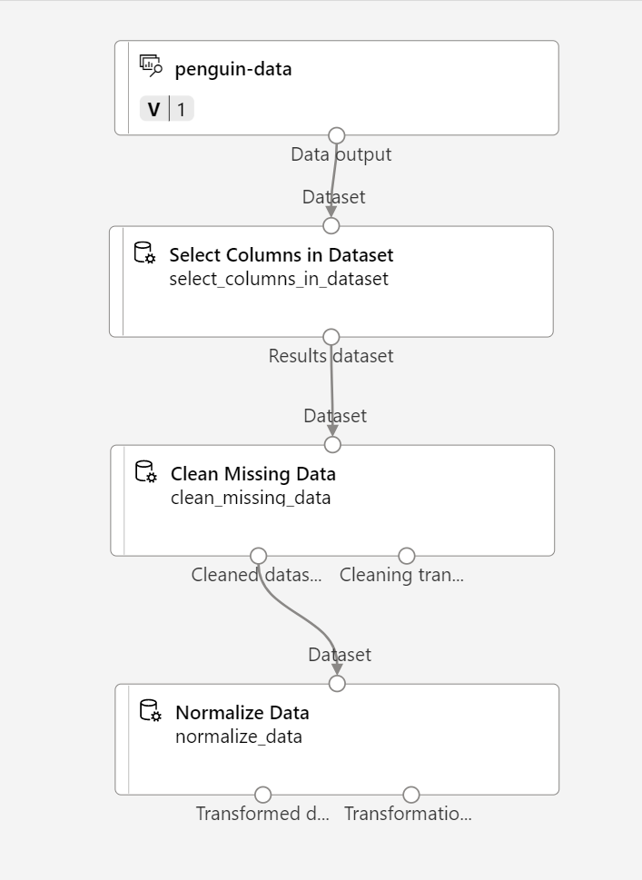

---
lab:
  title: Exploración de la agrupación en clústeres con el diseñador de Azure Machine Learning
---

# Exploración de la agrupación en clústeres con el diseñador de Azure Machine Learning

> **Nota** Para completar este laboratorio, necesitará una [suscripción de Azure](https://azure.microsoft.com/free?azure-portal=true) en la que tenga acceso de administrador.

## Creación de un área de trabajo de Azure Machine Learning  

1. Inicie sesión en [Azure Portal](https://portal.azure.com?azure-portal=true) con las credenciales de Microsoft.

1. Seleccione **+Crear un recurso**, busque *Machine Learning* y cree un recurso de **Azure Machine Learning** con un plan *Azure Machine Learning*. Use la configuración siguiente:
    - **Suscripción**: *su suscripción a Azure*.
    - **Grupo de recursos**: *cree o seleccione un grupo de recursos*.
    - **Nombre del área de trabajo**: *escriba un nombre único para el área de trabajo*.
    - **Región**: *seleccione la región geográfica más cercana*.
    - **Cuenta de almacenamiento**: *tenga en cuenta la nueva cuenta de almacenamiento predeterminada que se creará para el área de trabajo*.
    - **Almacén de claves**: *tenga en cuenta el nuevo almacén de claves predeterminado que se creará para el área de trabajo*.
    - **Application Insights**: *tenga en cuenta el nuevo recurso de Application Insights predeterminado que se creará para el área de trabajo*.
    - **Registro de contenedor**: ninguno (*se creará uno automáticamente la primera vez que implemente un modelo en un contenedor*).

1. Seleccione **Revisar y crear** y, luego, **Crear**. Espere a que se cree el área de trabajo (puede tardar unos minutos) y, a continuación, vaya al recurso implementado.

1. Seleccione **Iniciar estudio** (o abra una nueva pestaña del explorador y vaya a [https://ml.azure.com](https://ml.azure.com?azure-portal=true) e inicie sesión en estudio de Azure Machine Learning con su cuenta de Microsoft).

1. En estudio de Azure Machine Learning, debería ver el área de trabajo recién creada. Si no es el caso, seleccione el directorio de Azure en el menú de la izquierda. A continuación, en el nuevo menú de la izquierda, seleccione **Áreas de trabajo**, donde se muestran todas las áreas de trabajo asociadas al directorio y seleccione la que creó para este ejercicio.

> **Nota** Este módulo es uno de los muchos que hacen uso de un área de trabajo Azure Machine Learning, incluidos el resto de módulos de la ruta de aprendizaje[Microsoft Azure AI Fundamentals: exploración de las herramientas visuales para el aprendizaje automático](https://docs.microsoft.com/learn/paths/create-no-code-predictive-models-azure-machine-learning/). Si usa su propia suscripción de Azure, le recomendamos que cree el área de trabajo una vez y la reutilice en otros módulos. A la suscripción de Azure se le cargará un importe reducido por el almacenamiento de datos, siempre y cuando el área de trabajo de Azure Machine Learning exista en la suscripción, por lo que se recomienda eliminar el área de trabajo de Azure Machine Learning cuando ya no sea necesaria.

## Creación del proceso

1. En [Estudio de Azure Machine Learning](https://ml.azure.com?azure-portal=true), seleccione el icono **&#8801;** (un icono de menú que se parece a una pila de tres líneas) en la parte superior izquierda para ver las distintas páginas de la interfaz (es posible que tenga que maximizar el tamaño de la pantalla). Puede usar estas páginas del panel de la izquierda para administrar los recursos del área de trabajo. Vea la página **Proceso** (en **Administrar**).

2. En la página **Proceso**, seleccione la pestaña **Clústeres de proceso** y agregue un clúster de proceso nuevo con la configuración siguiente. Lo usará para entrenar un modelo de Machine Learning:
    - **Ubicación**: *seleccione la misma que el área de trabajo. Si esa ubicación no aparece, elija la más cercana.*
    - **Nivel de máquina virtual**: dedicado
    - **Tipo de máquina virtual**: CPU
    - **Tamaño de la máquina virtual**:
        - Elija **Seleccionar de entre todas las opciones**
        - Busque y seleccione **Standard_DS11_v2**
    - Seleccione **Siguiente**.
    - **Nombre del proceso**: *escriba un nombre único*.
    - **Número mínimo de nodos**: 0
    - **Número máximo de nodos**: 2
    - **Segundos de inactividad antes de la reducción vertical**: 120
    - **Habilitar acceso SSH**: Eliminar
    - Seleccione **Crear**

> **Nota** Las instancia de proceso y los clústeres se basan en imágenes de máquina virtual de Azure estándar. Para este módulo, se recomienda la imagen *Standard_DS11_v2* para lograr el equilibrio óptimo entre el costo y el rendimiento. Si la suscripción tiene una cuota que no incluye esta imagen, elija una imagen alternativa, pero tenga en cuenta que una imagen más grande puede incurrir en un costo mayor y una imagen más pequeña puede no ser suficiente para completar las tareas. Como alternativa, pida al administrador de Azure que amplíe la cuota.

El clúster de proceso tardará algún tiempo en crearse. Mientras espera, puede continuar con el siguiente paso.

## Creación de una canalización en el diseñador

Para empezar a trabajar con el diseñador de Azure Machine Learning, primero debe crear una canalización.

1. En [Estudio de Azure Machine Learning](https://ml.azure.com?azure-portal=true), expanda el panel izquierdo seleccionando el icono de menú de la parte superior izquierda de la pantalla. Vea la página **Diseñador** (en **Autor**) y seleccione el signo más para crear una canalización.

1. En la parte superior derecha de la pantalla, seleccione **Configuración**. Si el panel **Configuración** no está visible, seleccione el icono de la rueda dentada situado junto al nombre de la canalización en la parte superior.

1. En **Configuración**, tendrá que especificar un destino de proceso en el que ejecutar la canalización. En **Select compute type (Seleccionar tipo de proceso)**, seleccione **Clúster de proceso**. Después, en **Select Azure ML compute cluster (Seleccionar tipo de proceso de Azure ML)** , seleccione el clúster de proceso que creó anteriormente.

1. En **Configuración**, en **Detalles del borrador**, cambie el nombre del borrador (**Pipeline-Created-on-* date***) a **Train Penguin Clustering**.

1. Seleccione el *icono de cierre* en la esquina superior derecha del panel de **Configuración** para cerrarlo y, a continuación, seleccione **Guardar**.

    

## Crear un conjunto de datos

En Azure Machine Learning, los datos para el entrenamiento de modelos y otras operaciones se encapsulan normalmente en un objeto denominado *conjunto de datos*. En este módulo, usará un conjunto de datos que incluye observaciones de tres especies de pingüinos.

1. En [Estudio de Azure Machine Learning](https://ml.azure.com?azure-portal=true), expanda el panel izquierdo seleccionando el icono de menú de la parte superior izquierda de la pantalla. Vea la página **Datos** (en **Activos**). La página Datos contiene archivos de datos o tablas específicos con los que tiene previsto trabajar en Azure Machine Learning. También puede crear conjuntos de datos desde esta página.

1. En la página **Datos**, en la pestaña **Recursos de datos**, seleccione **Crear**. A continuación, configure un recurso de datos con las siguientes opciones:
    * **Tipo de datos**:
        * **Nombre**: penguin-data
        * **Descripción**: datos de pingüinos
        * **Tipo de conjunto de datos**: tabular
    * **Origen de datos**: desde archivos web
    * **Dirección URL web**: 
        * **Dirección URL web**: https://aka.ms/penguin-data
        * **Omitir validación de datos**: *no seleccionar*.
    * **Configuración**:
        * **Formato de archivo**: delimitado
        * **Delimitador**: coma
        * **Codificación**: UTF-8
        * **Encabezados de columna**: solo el primer archivo tiene encabezados
        * **Omitir filas**: ninguno
        * **Dataset contains multi-line data (El conjunto de datos contiene datos de varias líneas)**: *no seleccionar*
    * **Esquema**:
        * incluir todas las columnas que no sean **Ruta de acceso**
        * Revisar los tipos detectados automáticamente
    * **Revisar**
        * Seleccione **Crear**

1. Después de crear el conjunto de datos, ábralo y vea la página **Explorar** para obtener una muestra de los datos. Estos datos representan las medidas de longitud y profundidad de la parte más prominente (pico), la longitud de la aleta y la masa corporal de varias observaciones de pingüinos. El conjunto de datos representa tres especies de pingüino: *de Adelia*, *papúa* y *barbijo*.

> **Nota** El conjunto de datos sobre pingüinos que se usa en este ejercicio es un subconjunto de datos que han recopilado y hecho público el [Dr. Kristen Gorman](https://www.uaf.edu/cfos/people/faculty/detail/kristen-gorman.php) y la [Palmer Station, Antarctica LTER](https://pal.lternet.edu/), miembro de la [Long Term Ecological Research Network](https://lternet.edu/).

### Carga de datos al lienzo

1. Vuelva a la canalización seleccionando **Diseñador** en el menú de la izquierda. En la página **Diseñador**, seleccione **train penguin clustering (Entrenar clústeres de pingüinos**).

1. Junto al nombre de la canalización en el lado izquierdo, seleccione el icono de flechas para expandir el panel si está contraído. El panel debería abrirse de forma predeterminada en el **Panel biblioteca**, indicado por el icono de libros situado en la parte superior del panel. Tenga en cuenta que hay una barra de búsqueda para buscar activos. Encontrará dos botones: **Datos** y **Componentes**.

    

1. Haga clic en **Datos**. Busque y coloque el conjunto de datos **penguin-data** en el lienzo.

1. Haga clic con el botón derecho (Ctrl+clic en Mac) en el conjunto de datos **penguin-data** en el lienzo y haga clic en **Vista previa de los datos**.

1. Revise el esquema *Perfil* de los datos y observe que puede ver las distribuciones de las distintas columnas como histogramas. A continuación, seleccione la columna **CulmenLength**. El conjunto de datos debería tener un aspecto similar al siguiente:

    

1. Tenga en cuenta las siguientes características del conjunto de datos:

    - El conjunto de datos contiene las columnas siguientes:
        - **CulmenLength**: longitud del pico del pingüino en milímetros.
        - **CulmenDepth**: profundidad del pico del pingüino en milímetros.
        - **FlipperLength**: longitud de la aleta del pingüino en milímetros.
        - **BodyMass**: peso del pingüino en gramos.
        - **Species**: indicador de especie (0: "de Adelia"; 1: "papúa"; 2: "barbijo")
    - Faltan dos valores en la columna **CulmenLength** (también faltan dos valores en las columnas **CulmenDepth**, **FlipperLength** y **BodyMass**).
    - Los valores de las medidas están en diferentes escalas (de decenas de milímetros a miles de gramos).

1. Cierre la visualización del conjunto de datos para poder ver el conjunto de datos en el lienzo de la canalización.

## Aplicación de transformaciones

1. En el panel **Biblioteca de recursos** de la izquierda, haga clic en **Componentes**, que contiene una amplia gama de módulos que puede usar para la transformación de datos y el entrenamiento del modelo. También puede utilizar la barra de búsqueda para localizar los módulos con rapidez.

    

1. Para agrupar las observaciones sobre pingüinos, vamos a usar solo las medidas e ignoraremos la columna de especies. Busque un módulo **Seleccionar columnas en el conjunto de datos** y colóquelo en el lienzo, debajo del módulo **penguin-data**, y conecte la salida de la parte inferior del módulo **penguin-data** a la entrada de la parte superior del módulo **Seleccionar columnas en el conjunto de datos** de la siguiente manera:

    

1. Haga doble clic en el módulo **Seleccionar columnas en el conjunto de datos** y, en el panel de la derecha, seleccione **Editar columna**. Después, en la ventana **Seleccionar columnas**, seleccione **Por nombre** y use los vínculos **+** para seleccionar los nombres de columna **CulmenLength**, **CulmenDepth**, **FlipperLength** y **BodyMass** de la siguiente forma:

    

1. Cierre la configuración del módulo **Seleccionar columnas en un conjunto de datos** para volver al lienzo del diseñador.

1. En la **Biblioteca de recursos**, busque un módulo **Limpiar datos que faltan** y colóquelo en el lienzo, debajo del módulo **Seleccionar columnas en un conjunto de datos**, y conéctelos de la manera siguiente:

    

1. Haga doble clic en el módulo **Limpiar datos que faltan** y, en el panel de configuración de la derecha, haga clic en **Editar columna**. A continuación, en la ventana **Columnas para eliminar**, seleccione **Con reglas** e incluya **Todas las columnas**, así:

    

1. Con el módulo **Limpiar datos que faltan** aún seleccionado, en el panel Configuración, establezca las siguientes opciones de configuración:
    - **Relación mínima de valores que faltan**: 0,0
    - **Relación máxima de valores que faltan**: 1,0
    - **Modo de limpieza**: quitar toda la fila

1. En la **Biblioteca de recursos**, busque un módulo **Normalizar datos** y colóquelo en el lienzo, debajo del módulo **Limpiar datos que faltan**. Después, conecte la salida del módulo **Limpiar datos que faltan** a la entrada del módulo **Normalizar datos**.

    

1. Haga doble clic en el módulo **Normalizar datos** y, en el panel de la derecha, establezca el **Método de transformación** en **MinMax** y seleccione **Editar columna**. A continuación, en la ventana **Columnas para modificar**, seleccione **Con reglas** e incluya **Todas las columnas**, así:

    

1. Cierre la configuración del módulo **Normalizar datos** para volver al lienzo del diseñador.

## Ejecución de la canalización

Para aplicar las transformaciones de datos, debe ejecutar la canalización como un experimento.

1. Seleccione **Enviar** y ejecute la canalización como un **nuevo experimento** denominado **mslearn-penguin-training** en el clúster de proceso.

1. Espere a que finalice. Esto puede tardar cinco minutos o más.

    

    Observe que el panel izquierdo está ahora en el panel **Trabajos enviados**. Sabrá cuándo se completa la ejecución porque el estado del trabajo cambiará a **Completado**.

## Visualización de los datos transformados

1. Una vez completada la ejecución, el conjunto de datos ya está preparado para el entrenamiento del modelo. Haga clic en **Detalles del trabajo**. Se le dirigirá a otra ventana que mostrará los módulos de la siguiente manera:

    

1. En la nueva ventana, haga clic con el botón derecho en el módulo **Normalizar datos**, seleccione **Vista previa de los datos** y, después, seleccione **Conjunto de datos transformado** para ver los resultados.

1. Fíjese en los datos: la columna **Especie** se ha suprimido, no faltan valores y los valores de las cuatro características se han normalizado a una misma escala.

1. Cierre la visualización del resultado normalizado de los datos. Vuelva a la ventana anterior de la canalización.

Ahora que ha seleccionado y preparado las características que quiere utilizar del conjunto de datos, ya puede usarlos para entrenar un modelo de agrupación en clústeres.

Después de haber usado transformaciones de datos para preparar los datos, puede usarlos para entrenar un modelo de Machine Learning.

## Adición de módulos de entrenamiento

Lleve a cabo los pasos siguientes para ampliar la canalización **Train Penguin Clustering** como se muestra aquí:


Siga estos pasos y use la imagen anterior como referencia a medida que agrega y configura los módulos necesarios.

1. Si no está abierta, abra la canalización **Entrenar clústeres sobre pingüinos**.

1. En el panel**Biblioteca** de la izquierda, busque y coloque un módulo **Dividir datos** en el lienzo debajo del módulo **Normalizar datos**. Después, conecte la salida del módulo **Normalizar los datos** a la entrada del módulo **Dividir datos**.

    >**Consejo** Use la barra de búsqueda para localizar los módulos con rapidez. 

1. Seleccione el módulo **Dividir datos** y configure sus valores como se indica a continuación:
    * **Modo de división**: dividir filas
    * **Fracción de filas del primer conjunto de datos de salida**: 0,7
    * **División aleatoria**: True
    * **Valor de inicialización aleatorio**: 123
    * **División estratificada**: falso

1. En el **Panel biblioteca**, busque y coloque un módulo **Entrenar modelo de agrupación en clústeres** en el lienzo, en el módulo **Dividir datos**. Después, conecte la salida *Conjunto de datos de resultados 1* (izquierda) del módulo **Dividir datos** a la entrada *Conjunto de datos* (derecha) del módulo **Entrenar modelo de agrupación en clústeres**.

1. El modelo de agrupación en clústeres debe asignar clústeres a los elementos de datos mediante todas las características seleccionadas en el conjunto de datos original. Haga doble clic en el módulo **Entrenar modelo de agrupación en clústeres** y, en el panel de la derecha, seleccione **Editar columna**. Use la opción **Con reglas** para incluir todas las columnas, de esta manera:

    

1. El modelo que vamos a entrenar usará las características para agrupar los datos en clústeres, por lo que tendremos que entrenar el modelo mediante un algoritmo de *agrupación en clústeres*. En la **Biblioteca de recursos**, busque y coloque un módulo **Agrupación en clústeres K-Means** en el lienzo, a la izquierda del conjunto de datos **penguin-data** y por encima del módulo **Entrenar modelo de agrupación en clústeres**. Después, conecte su salida a la entrada **Modelo no entrenado** (izquierda) del módulo **Entrenar modelo de agrupación en clústeres**.

1. El algoritmo *K-Means* agrupa los elementos en el número de clústeres que especifique, un valor que se conoce como ***K***. Seleccione el módulo **Agrupación en clústeres K-Means** y, en el panel de la derecha, establezca el parámetro **Número de centroides** en **3**.

    > **Nota** Considere las observaciones de datos, por ejemplo, las medidas de los pingüinos, como vectores multidimensionales. El algoritmo K-means funciona de la forma siguiente:
    > 1. Inicializa las coordenadas *K* como puntos seleccionados aleatoriamente denominados *centroides* en un espacio dimensional*n* (donde *n* es el número de dimensiones de los vectores de características).
    > 2. Traza los vectores de las características como puntos en el mismo espacio y asigna cada punto a su centroide más cercano.
    > 3. Mueve los centroides al centro de los puntos que tiene asignados, en función de la distancia *media*.
    > 4. Reasigna los puntos a su centroide más cercano después del movimiento.
    > 5. Repite los pasos 3 y 4 hasta que las asignaciones de clústeres se estabilizan o hasta que se completa el número de iteraciones especificado.

   Después de usar el 70 % de los datos para entrenar el modelo de agrupación en clústeres, puede usar el 30 % restante para hacer pruebas usando el modelo para asignar los datos a los clústeres.

1. En la **Biblioteca de recursos**, busque y coloque un módulo **Asignar datos a clústeres** en el lienzo, debajo del módulo **Entrenar modelo de agrupación en clústeres**. Después, conecte la salida **Modelo entrenado** (izquierda) del módulo **Entrenar modelo de agrupación en clústeres** a la entrada **Modelo entrenado** (izquierda) del módulo **Asignar datos a clústeres** y conecte la salida **Conjunto de datos de resultados 2** (derecha) del módulo **Dividir datos** a la entrada **Conjunto de datos** (derecha) del módulo **Asignar datos a clústeres**.

## Ejecución de la canalización de entrenamiento

Ya está a punto para ejecutar la canalización de entrenamiento y entrenar el modelo.

1. Asegúrese de que la canalización es similar a la siguiente:

    

1. Seleccione **Enviar** y ejecute la canalización mediante el experimento existente denominado **mslearn-penguin-training** en el clúster de proceso.

1. Espere a que finalice la ejecución del experimento. Esto puede tardar cinco minutos o más.

1. Cuando se haya completado la ejecución del experimento, seleccione **Detalles del trabajo**. En la nueva ventana, haga clic con el botón derecho en el módulo **Asignar datos a clústeres**, seleccione **Vista previa de los datos** y, después, seleccione **Conjunto de datos de resultados** para ver los resultados.

1. Desplácese hacia abajo y observe la columna **Asignaciones**, que contiene el clúster (0, 1 o 2) al que se asigna cada fila. También hay nuevas columnas que indican la distancia desde el punto que representa esta fila hasta los centros de cada uno de los clústeres; el clúster más cercano al punto es aquel al que está asignado.

1. Cierre la visualización **Asignar datos a clústeres**. Vuelva a la ventana de la canalización.

El modelo predice clústeres para las observaciones de pingüinos, pero ¿qué fiabilidad tienen estas predicciones? Para valorarlo, tendrá que evaluar el modelo.

La evaluación de un modelo de agrupación en clústeres se complica por el hecho de que no hay valores *true* conocidos de antemano para las asignaciones de clústeres. Un modelo de agrupación en clústeres correcto es el que consigue un buen nivel de separación entre los elementos de cada clúster, por lo que necesitamos métricas que nos ayuden a medir esa separación.

## Adición de un módulo Evaluar modelo

1. Abra la canalización **Entrenar clústeres sobre pingüinos** que ha creado en la unidad anterior si todavía no está abierta.

1. En la **Biblioteca de recursos**, busque y coloque un módulo **Evaluar modelo** en el lienzo, en el módulo **Asignar datos a clústeres**. Conecte la salida del módulo **Asignar datos a clústeres** a la entrada **Conjunto de datos puntuado** (izquierda) del módulo **Evaluar modelo**.

1. Asegúrese de que la canalización es similar a la siguiente:

    

1. Seleccione **Enviar** y ejecute la canalización mediante el experimento existente **mslearn-penguin-training**.

1. Espere a que finalice la ejecución del experimento.

1. Cuando se haya completado la ejecución del experimento, seleccione **Detalles del trabajo**. Haga clic con el botón derecho en el módulo **Evaluar modelo** y seleccione **Vista previa de los datos** y, a continuación, **Resultados de la evaluación**. Revise las métricas de cada fila:
    - **Distancia media a otro centro**
    - **Distancia media al centro del clúster**
    - **Número de puntos**
    - **Distancia máxima al centro del clúster**

1. Cierre la ventana **Visualización del resultado de Evaluar modelo**.

Ahora que tiene un modelo de agrupación en clústeres en funcionamiento, puede usarlo para asignar datos nuevos a los clústeres en una *canalización de inferencias*.

Después de crear y ejecutar una canalización para entrenar el modelo de clúster, puede crear una *canalización de inferencia*. La canalización de inferencia usa el modelo para asignar nuevas observaciones de datos a los clústeres. Este modelo formará la base de un servicio predictivo que puede publicar para que lo usen las aplicaciones.

## Creación de una canalización de inferencia

1. En Estudio de Azure Machine Learning, expanda el panel izquierdo seleccionando el icono de menú de la parte superior izquierda de la pantalla. Haga clic en **Trabajos** (en **Activos**) para ver todos los trabajos que ha ejecutado. Seleccione el experimento **mslearn-penguin-training** y, después, la canalización **mslearn-penguin-training**. 

1. Busque el menú situado encima del lienzo y haga clic en **Create inference pipeline (Crear canalización de inferencia)**. Es posible que tenga que acceder a la pantalla completa y hacer clic en el icono **...** en la esquina superior derecha de la pantalla para buscar **Crear canalización de inferencia** en el menú.  

     

1. En la lista desplegable **Crear canalización de inferencia**, haga clic en **Canalización de inferencia en tiempo real**. Después de unos segundos, se abrirá una versión nueva de la canalización denominada **Entrenar clústeres sobre pingüinos, inferencia en tiempo real**.

1. Vaya a **Configuración** en el menú superior derecho. En **Detalles del borrador**, cambie el nombre de la nueva canalización a **Predecir clústeres de pingüinos** y, después, revísela. Las transformaciones y el modelo de agrupación en clústeres de la canalización de entrenamiento forman parte de esta canalización. El modelo entrenado se usará para puntuar los nuevos datos. La canalización también contiene una salida de servicio web para devolver resultados. 

    Va a realizar los cambios siguientes en la canalización de inferencia:

    

    - Agregue un componente de **entrada de servicio web** para que se envíen nuevos datos.
    - Reemplace el conjunto de datos **penguin-data** por un componente **Escribir manualmente los datos** que no incluya la columna **Especie**.
    - Elimine el componente **Seleccionar columnas en el conjunto de datos**, ya que ahora es redundante.
    - Conecte los componentes **Entrada del servicio web** y **Escribir manualmente los datos** (que representan las entradas de datos que se van a agrupar) en el primer componente **Aplicar transformación**.

    Siga los pasos restantes que se indican a continuación, y use la imagen y la información anterior como referencia mientras modifica la canalización.

1. La canalización no incluye automáticamente un componente **de entrada de servicio web** para los modelos creados a partir de conjuntos de datos personalizados. Busque un componente **de entrada de servicio web** desde la biblioteca de recursos y colóquelo en la parte superior de la canalización.  Conecte la salida del componente **Entrada de servicio web** a la entrada del componente **Aplicar transformación** que ya está en el lienzo.  

1. La canalización de inferencia supone que los datos nuevos coincidirán con el esquema de los datos de entrenamiento originales, por lo que se incluye el conjunto de datos **penguin-data** de la canalización de entrenamiento. Sin embargo, estos datos de entrada incluyen una columna para las especies de pingüinos que el modelo no utiliza. Elimine el conjunto de datos **penguin-data** y el módulo **Seleccionar columnas en el conjunto de datos**, y reemplácelos por el módulo **Escribir manualmente los datos** de la **Biblioteca de recursos**. A continuación, modifique la configuración del módulo **Escribir manualmente los datos** para usar la siguiente entrada CSV, que contiene valores de características para tres nuevas observaciones de los pingüinos (incluidos los encabezados):

    ```CSV
    CulmenLength,CulmenDepth,FlipperLength,BodyMass
    39.1,18.7,181,3750
    49.1,14.8,220,5150
    46.6,17.8,193,3800
    ```

1. Conecte las salidas de los módulos **Entrada del servicio web** y **Escribir manualmente los datos** a la entrada del conjunto de datos (derecha) del primer módulo **Aplicar transformación**.

1. Elimine el módulo **Evaluar modelo**.

1. Compruebe que la canalización tiene un aspecto similar a la imagen siguiente:

    

1. Envíe la canalización como un nuevo experimento denominado **mslearn-penguin-inference** en el clúster de proceso. El experimento puede tardar un tiempo en ejecutarse.

1. Cuando se haya completado la canalización, seleccione **Detalles del trabajo**. En la nueva pestaña, haga clic con el botón derecho en el módulo **Asignar datos a clústeres** y seleccione **Vista previa de los datos** y seleccione **Conjunto de datos de resultados** para ver las asignaciones y métricas de clúster predichas para las tres observaciones de pingüinos en los datos de entrada.

La canalización de inferencia asigna las observaciones de pingüinos a los clústeres en función de sus características. Ya está a punto para publicar la canalización a fin de que las aplicaciones cliente la puedan usar.

>**Nota**: En este ejercicio, implementará el servicio web en una instancia de Azure Container (ACI). Este tipo de proceso se crea dinámicamente y resulta útil para el desarrollo y las pruebas. Para la producción, debe crear un *clúster de inferencia*; esto proporciona un clúster de Azure Kubernetes Service (AKS) que ofrece más escalabilidad y seguridad.

## Implementación de un servicio

1. Vea la canalización de inferencia **Predecir clústeres de pingüinos** que ha creado en la unidad anterior.

1. Seleccione **Detalles del trabajo** en el panel izquierdo. Se abrirá otra pestaña.

    

1. En la nueva pestaña, seleccione **Implementar**.

    

1. Implemente un nuevo punto de conexión en tiempo real con la siguiente configuración:
    -  **Nombre**: predict-penguin-clusters
    -  **Descripción**: permite agrupar pingüinos en clústeres.
    - **Tipo de proceso**: instancia de Azure Container.

1. Espere a que se implemente el servicio web; esto puede tardar varios minutos. 

1. Para ver el estado de la implementación, expanda el panel izquierdo seleccionando el icono de menú de la parte superior izquierda de la pantalla. Vea la página **Puntos de conexión** (en **Activos**) y seleccione **predict-penguin-clusters**. Una vez finalizada la implementación, el **estado implementación** cambiará a **Correcto**.

## Probar el servicio

1. En la página **Puntos de conexión**, abra el punto de conexión en tiempo real **predict-penguin-clusters** y seleccione la pestaña **Probar**.

    

1. Lo usaremos para probar el modelo con nuevos datos. Elimine los datos actuales en **Datos de entrada para probar el punto de conexión en tiempo real**. Copie y pegue los datos siguientes en la sección de datos: 

    ```JSON
    {
        "Inputs": {
            "input1": [
                {
                    "CulmenLength": 49.1,
                    "CulmenDepth": 4.8,
                    "FlipperLength": 1220,
                    "BodyMass": 5150
                }
            ]
        },
        "GlobalParameters":  {}
    }
    ```

    > **Nota** El JSON anterior define las características de un pingüino y usa el servicio **predict-penguin-clusters** que ha creado para predecir una asignación de clústeres.

1. Seleccione **Probar**. En la parte derecha de la pantalla, debería ver la salida **"assignments"** . Observe cómo el clúster asignado es el que tiene la distancia más corta al centro del clúster.

    

Acaba de probar un servicio que está listo para conectarse a una aplicación cliente mediante las credenciales de la pestaña **Consumir**. Terminaremos el laboratorio aquí. Si lo desea, puede seguir experimentando con el servicio que acaba de implementar.

## Limpieza

El servicio web que se ha creado se hospeda en una *instancia de Azure Container*. Si no tiene previsto experimentar con él, debe eliminar el punto de conexión para evitar el uso innecesario de Azure. También debe eliminar el clúster de proceso.

1. En [Azure Machine Learning Studio](https://ml.azure.com?azure-portal=true), en la pestaña **Puntos de conexión**, seleccione el punto de conexión **predict-penguin-clusters**. Después, seleccione **Eliminar** (&#128465;) y confirme que quiere eliminar el punto de conexión.

1. En la página **Proceso**, en la pestaña **Instancias de proceso**, seleccione su instancia de proceso y, luego, **Eliminar**.

>**Nota:** Al eliminar el proceso, garantiza que no se cobren los recursos de proceso en la suscripción. Sin embargo, se le cobrará un importe reducido por el almacenamiento de datos, siempre que el área de trabajo de Azure Machine Learning exista en la suscripción. Si ha terminado de explorar Azure Machine Learning, puede eliminar el área de trabajo de Azure Machine Learning y los recursos asociados. Sin embargo, si planea completar cualquier otro laboratorio de esta serie, tendrá que volver a crearla.
>
> Para eliminar el área de trabajo:
>
> 1. En [Azure Portal](https://portal.azure.com?azure-portal=true), en la página **Grupos de recursos**, abra el grupo de recursos que haya especificado al crear el área de trabajo de Azure Machine Learning.
> 1. Haga clic en **Eliminar grupo de recursos**, escriba el nombre del grupo de recursos para confirmar que quiere eliminarlo y seleccione **Eliminar**.
