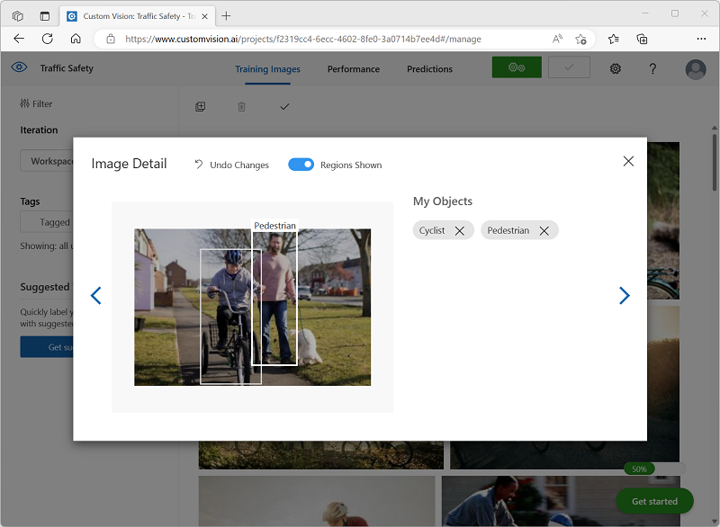

---
lab:
  title: Exploración de la detección de objetos
---

# Exploración de la detección de objetos

> **Nota** Para completar este laboratorio, necesitará una [suscripción de Azure](https://azure.microsoft.com/free?azure-portal=true) en la que tenga acceso de administrador.

La *detección de objetos* es una forma de visión informática en la que se entrena un modelo de Machine Learning para clasificar instancias individuales de objetos en una imagen e indicar un *cuadro de límite* que marque su ubicación. Puede pensar en esto como una progresión de la *clasificación de imágenes* (en la que el modelo responde a la pregunta "¿de qué es esto una imagen?") para la compilación de soluciones en las que podemos preguntar al modelo "¿qué objetos hay en esta imagen y dónde están?".

Por ejemplo, una iniciativa de seguridad vial podría identificar a los peatones y ciclistas como los usuarios de carreteras más vulnerables en las intersecciones de tráfico. Mediante el uso de cámaras para supervisar intersecciones, se podrían analizar imágenes de los usuarios de carreteras para detectar peatones y ciclistas con el fin de supervisar sus números o incluso cambiar el comportamiento de las señales de tráfico.

El servicio **Custom Vision** de Microsoft Azure proporciona una solución basada en la nube para la creación y publicación de modelos de detección de objetos personalizados. En Azure, puede usar el servicio Custom Vision para entrenar un modelo de detección de objetos basado en imágenes existentes. Hay dos elementos para crear una solución de detección de objetos. En primer lugar, debe entrenar un modelo para detectar la ubicación y la clase de objetos mediante imágenes etiquetadas. Después, una vez entrenado el modelo, debe publicarlo como un servicio que pueden consumir las aplicaciones.

Para probar las funcionalidades del servicio Custom Vision para detectar objetos en imágenes, usaremos una sencilla aplicación de línea de comandos que se ejecuta en Cloud Shell. Los mismos principios y funcionalidad se aplican en soluciones reales, como sitios web o aplicaciones móviles.

## Creación de un grupo de recursos de *servicios de Azure AI*

Para usar el servicio Computer Vision, debe crear un recurso de **Custom Vision** o de los **servicios de Azure AI**.

> **Nota** No todos los recursos están disponibles en todas las regiones. Tanto si crea un recurso de Custom Vision como de servicios de Azure AI, para acceder a los servicios de Custom Vision, solo se pueden usar los recursos creados en [determinadas regiones](https://azure.microsoft.com/global-infrastructure/services/?products=cognitive-services). Para simplificar el proceso, se selecciona previamente una región en las instrucciones de configuración siguientes.

Cree un recurso de los **servicios de Azure AI** en su suscripción de Azure.

1. En otra pestaña del explorador, abra Azure Portal en [https://portal.azure.com](https://portal.azure.com?azure-portal=true) e inicie sesión con su cuenta Microsoft.

1. Haga clic en el botón **&#65291;Crear un recurso** y busque *Servicios de Azure AI*. Seleccione **Crear** un plan de **servicios de Azure AI**. Se le dirigirá a una página para crear un recurso de servicios de Azure AI. Configúrelo con los valores siguientes:
    - **Suscripción**: *su suscripción a Azure*.
    - **Grupo de recursos**: *cree o seleccione un grupo de recursos con un nombre único*.
    - **Región**: Este de EE. UU.
    - **Nombre**: *escriba un nombre único*.
    - **Plan de tarifa**: estándar S0
    - **Al marcar esta casilla, confirmo que he leído y comprendido todos los términos que aparecen a continuación**: Seleccionado.

1. Revise y cree el recurso y espere a que finalice la implementación. A continuación, vaya al recurso implementado.

1. Vea la página **Claves y punto de conexión** del recurso de servicios de Azure AI. Necesitará el punto de conexión y las claves para conectarse desde las aplicaciones cliente.

## Creación de un proyecto de Custom Vision

Para entrenar un modelo de detección de objetos, debe crear un proyecto de Custom Vision basado en el recurso de entrenamiento. Para hacerlo, debe usar el portal de Custom Vision.

1. En una nueva pestaña del explorador, abra el portal de Custom Vision en [https://customvision.ai](https://customvision.ai?azure-portal=true) e inicie sesión con la cuenta de Microsoft asociada a su suscripción de Azure.

1. Cree un proyecto con la siguiente configuración:
    - **Nombre**: Seguridad del tráfico
    - **Descripción**: Detección de objetos para la seguridad vial.
    - **Recurso**: *el recurso creado anteriormente*
    - **Tipos de proyecto**: detección de objetos
    - **Dominios**: General \[A1]

1. Espere a que el proyecto se cree y abra en el explorador.

## Adición y etiquetado de imágenes

Para entrenar un modelo de detección de objetos, debe cargar imágenes que contengan las clases con las que desea que se identifique el modelo y etiquetarlas para indicar cuadros de límite para cada instancia de objeto.

1. Descargue y extraiga las imágenes de entrenamiento de [https://aka.ms/traffic-images](https://aka.ms/traffic-images). La carpeta extraída contiene una colección de imágenes de ciclistas y peatones.

1. En el portal de Custom Vision, en el proyecto de detección de objetos **Seguridad vial**, seleccione **Agregar imágenes** y cargue todas las imágenes de la carpeta extraída.

    

1. Una vez cargadas las imágenes, seleccione la primera para abrirla.

1. Mantenga presionado el mouse sobre cualquier objeto (ciclista o peatón) de la imagen hasta que se muestre una región detectada automáticamente. A continuación, seleccione el objeto y, si es necesario, cambie el tamaño de la región para rodearlo. Como alternativa, simplemente puede arrastrar alrededor del objeto para crear una región.

    Cuando el objeto está bien seleccionado dentro de la región rectangular, escriba la etiqueta adecuada para el objeto (*Ciclista* o *Peatón*) y use el botón **Etiquetar región** ( **+** ) para agregar la etiqueta al proyecto.

    

1. Use el vínculo **Siguiente** ( **(>)** de la derecha para pasar a la siguiente imagen y etiquetar sus objetos. A continuación, siga trabajando en toda la colección de imágenes, etiquetando cada ciclista y peatón.

    A medida que etiquete las imágenes, tenga en cuenta lo siguiente:

    - Algunas imágenes contienen varios objetos, posiblemente de tipos diferentes. Etiquete cada uno, incluso si se superponen.
    - Después de escribir una etiqueta una vez, puede seleccionarla en la lista al etiquetar nuevos objetos.
    - Puede retroceder y avanzar por las imágenes para ajustar las etiquetas.

    

1. Cuando haya terminado de etiquetar la última imagen, cierre el editor **Detalles de la imagen** y, en la página **Imágenes de entrenamiento**, en **Etiquetas**, seleccione **Etiquetado** para ver todas sus imágenes etiquetadas:

    

## Entrenamiento y prueba de un modelo

Ahora que ha etiquetado las imágenes del proyecto, está listo para entrenar un modelo.

1. En el proyecto de Custom Vision, haga clic en **Entrenar** para entrenar un modelo de detección de objetos mediante las imágenes etiquetadas. Seleccione la opción **Entrenamiento rápido**.

    > **Sugerencia**: El entrenamiento puede tardar varios minutos. Mientras espera, consulte [Análisis de vídeo para ciudades inteligentes](https://www.microsoft.com/research/video/video-analytics-for-smart-cities/), donde se describe un proyecto real para usar Computer Vision en una iniciativa de mejora de la seguridad vial.

2. Cuando se complete el entrenamiento, revise las métricas de rendimiento *Precisión*, *Coincidencia* y *Asignación*, que miden la corrección de la precisión del modelo de detección de objetos y deben ser todas razonablemente altas.

3. Ajuste el **Umbral de probabilidad** a la izquierda, incrementándolo del 50  al 90 %, y observe el efecto en las métricas de rendimiento. Esta configuración determina el valor de probabilidad que cada evaluación de etiquetas debe cumplir o superar para contarse como predicción.

    

4. En la esquina superior derecha de la página, haga clic en **Prueba rápida** y, después, en el cuadro **Dirección URL de imagen**, escriba `https://aka.ms/pedestrian-cyclist` y vea los resultados.

    En el panel de la derecha, en **Predicciones**, cada objeto detectado aparece con su etiqueta y probabilidad. Seleccione cada objeto para verlo resaltado en la imagen.

    Es posible que los objetos previstos no sean todos correctos: después de todo, los ciclistas y los peatones comparten muchas características comunes. Las predicciones en las que más confía el modelo tienen los valores de probabilidad más altos. Use el control deslizante **Valor de umbral** para eliminar objetos con una probabilidad baja. Debería poder encontrar un punto en el que solo se incluyen las predicciones correctas (probablemente en torno al 85-90 %).

    

5. A continuación, cierre la ventana **Prueba rápida**.

## Publicación del modelo de detección de objetos

Ahora está listo para publicar el modelo entrenado y usarlo desde una aplicación cliente.

1. Haga clic en **&#128504; Publicar** para publicar el modelo entrenado con la configuración siguiente:
    - **Nombre del modelo**: Seguridad vial
    - **Recurso de predicción**: *el recurso creado anteriormente*.

1. Después de la publicación, haga clic en *Dirección URL de predicción* (&#127760;) para ver la información necesaria para usar el modelo publicado.

    

Más adelante, necesitará la dirección URL y los valores Prediction-Key adecuados para obtener una predicción de una dirección URL de imagen, por lo que debe mantener este cuadro de diálogo abierto y continuar con la siguiente tarea.

## Preparación de una aplicación cliente

Para probar las funcionalidades del servicio Custom Vision, usaremos una sencilla aplicación de línea de comandos que se ejecuta en Cloud Shell en Azure.

1. Vuelva a la pestaña del explorador que contiene Azure Portal y seleccione el botón **Cloud Shell** ( **[>_]** ) situado en la parte superior de la página a la derecha del cuadro de búsqueda. Se abre un panel de Cloud Shell en la parte inferior del portal.

    La primera vez que abra Cloud Shell, es posible que se le pida que elija el tipo de shell que desea usar (*Bash* o *PowerShell*). En su caso, seleccione **PowerShell**.

    Si se le pide que cree almacenamiento para Cloud Shell, asegúrese de que se haya seleccionado su suscripción y seleccione **Crear almacenamiento**. A continuación, espere un minuto más o menos a que se cree el almacenamiento.

    Cuando Cloud Shell esté listo, debería tener un aspecto similar al siguiente:
    
    

    > *Sugerencia*: Asegúrese de que el tipo de shell indicado en la parte superior izquierda del panel de Cloud Shell es **PowerShell**. Si es *Bash*, cambie a *PowerShell* mediante el menú desplegable.

    Tenga en cuenta que puede cambiar el tamaño de Cloud Shell arrastrando la barra de separación en la parte superior del panel, o usando los iconos **&#8212;** , **&#9723;** y **X** en la parte superior derecha para minimizar, maximizar y cerrar el panel. Para obtener más información sobre el uso de Azure Cloud Shell, consulte la [documentación de Azure Cloud Shell](https://docs.microsoft.com/azure/cloud-shell/overview).

2. En el shell de comandos, escriba los siguientes comandos para descargar los archivos de este ejercicio y guárdelos en una carpeta denominada **ai-900** (después de quitar esa carpeta si ya existe).

    ```PowerShell
    rm -r ai-900 -f
    git clone https://github.com/MicrosoftLearning/AI-900-AIFundamentals ai-900
    ```

3. Una vez descargados los archivos, escriba los siguientes comandos para cambiar al directorio **ai-900** y edite el archivo de código para este ejercicio:

    ```PowerShell
    cd ai-900
    code detect-objects.ps1
    ```

    Observe cómo se abre un editor como el de la imagen siguiente:

     

     > **Sugerencia**: Puede usar la barra de separación entre la línea de comandos de Cloud Shell y el editor de código para cambiar el tamaño de los paneles.

4. No se preocupe demasiado por los detalles del código. Lo importante es que comience con algún código para especificar la dirección URL de predicción y la clave del modelo de Custom Vision. Deberá actualizar para que el resto del código use el modelo.

    Obtenga la *Dirección URL de predicción* y la *Clave de predicción* del cuadro de diálogo que dejó abierto en la pestaña del explorador del proyecto de Custom Vision. Necesita las versiones que debe usar *si tiene una dirección URL de la imagen*.

    Use estos valores para reemplazar los marcadores de posición **YOUR_PREDICTION_URL** y **YOUR_PREDICTION_KEY** en el archivo de código.

    Después de pegar los valores de dirección URL de predicción y clave de predicción, las dos primeras líneas de código deben tener un aspecto similar al siguiente:

    ```PowerShell
    $predictionUrl="https..."
    $predictionKey ="1a2b3c4d5e6f7g8h9i0j...."
    ```

5. Después de realizar los cambios en las variables del código, presione **CTRL+S** para guardar el archivo. Después, presione **Ctrl+Q** para cerrar el editor de código.

## Prueba de la aplicación cliente

Ahora puede usar la aplicación cliente de ejemplo para detectar ciclistas y peatones en las imágenes.

1. En el panel de PowerShell, escriba el siguiente comando para ejecutar el código:

    ```PowerShell
    ./detect-objects.ps1 1
    ```

    Este código usa el modelo para detectar objetos en la siguiente imagen:

    

1. Revise la predicción, que enumera los objetos detectados con una probabilidad del 90 % o más, junto con las coordenadas de un rectángulo de selección alrededor de su ubicación.

1. Ahora vamos a probar otra imagen. Ejecute este comando:

    ```PowerShell
    ./detect-objects.ps1 2
    ```

    Esta vez se analiza la siguiente imagen:

    

Esperamos que el modelo de detección de objetos haya hecho un buen trabajo para detectar peatones y ciclistas en las imágenes de prueba.

