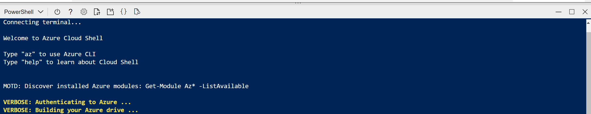

---
lab:
  title: Explorar transacción
---

# <a name="explore-translation"></a>Explorar transacción

> **Nota** Para completar este laboratorio, necesitará una [suscripción de Azure](https://azure.microsoft.com/free?azure-portal=true) en la que tenga acceso de administrador.

Una de las fuerzas motrices que ha permitido el desarrollo de la civilización humana es la capacidad de comunicación. En la mayoría de las actividades humanas, la comunicación es fundamental.

La inteligencia artificial (IA) puede ayudar a simplificar la comunicación mediante la traducción de texto o voz entre idiomas, lo que ayuda a eliminar las barreras a la comunicación entre países y culturas.

Para probar las funcionalidades del servicio Translator, usaremos una sencilla aplicación de línea de comandos que se ejecuta en Cloud Shell. Los mismos principios y funcionalidad se aplican en soluciones reales, como sitios web o aplicaciones de teléfono.

## <a name="create-a-cognitive-services-resource"></a>Creación de un recurso de *Cognitive Services*

Para poder usar el servicio Translator, cree un recurso de **Translator** o un recurso de **Cognitive Services**.

Si aún no lo ha hecho, cree un recurso de **Cognitive Services** en la suscripción de Azure.

1. En otra pestaña del explorador, abra Azure Portal en [https://portal.azure.com](https://portal.azure.com?azure-portal=true) e inicie sesión con su cuenta Microsoft.

1. Seleccione el botón **&#65291;Crear un recurso**, busque *Cognitive Services* y cree un recurso de **Cognitive Services** con la siguiente configuración:
    - **Suscripción**: *su suscripción a Azure*.
    - **Grupo de recursos**: *cree o seleccione un grupo de recursos con un nombre único*.
    - **Región**: *elija cualquier región disponible*.
    - **Nombre**: *escriba un nombre único*.
    - **Plan de tarifa**: estándar S0
    - **Al marcar esta casilla, confirmo que he leído y comprendido todos los términos que aparecen a continuación**: Seleccionado.

1. Revise y cree el recurso y espere a que finalice la implementación. A continuación, vaya al recurso implementado.

1. Vea la página **Claves y punto de conexión** del recurso de Cognitive Services. Necesitará las claves y la ubicación para conectarse desde las aplicaciones cliente.

### <a name="get-the-key-and-location-for-your-cognitive-services-resource"></a>Obtención de la clave y la ubicación del recurso de Cognitive Services

1. Espere a que la implementación finalice. Después, vaya al recurso de Cognitive Services y, en la página **Información general**, seleccione el vínculo para administrar las claves del servicio. Necesitará las claves y la ubicación para conectarse al recurso de Cognitive Services desde las aplicaciones cliente.

1. Vea la página **Claves y punto de conexión** del recurso. Necesitará la **ubicación/región** y la **clave** para conectarse desde las aplicaciones cliente.

> **Nota** Para usar el servicio Translator no es necesario usar el punto de conexión de Cognitive Services. Se proporciona un punto final global solo para el servicio Translator. 

## <a name="run-cloud-shell"></a>Ejecución de Cloud Shell

Para probar las funcionalidades del servicio de traducción, usaremos una sencilla aplicación de línea de comandos que se ejecuta en Cloud Shell en Azure. 

1. En Azure Portal, seleccione el botón **[>_]** (*Cloud Shell*) situado en la parte superior de la página, a la derecha del cuadro de búsqueda. Se abre un panel de Cloud Shell en la parte inferior del portal.

    

1. La primera vez que abra Cloud Shell, es posible que se le pida que elija el tipo de shell que desea usar (*Bash* o *PowerShell*). Seleccione **PowerShell**. Si no ve esta opción, omita el paso.  

1. Si se le pide que cree almacenamiento para Cloud Shell, asegúrese de que se haya especificado su suscripción y seleccione **Crear almacenamiento**. A continuación, espere un minuto más o menos a que se cree el almacenamiento.

    

1. Asegúrese de que el tipo de shell indicado en la parte superior izquierda del panel de Cloud Shell se cambia a *PowerShell*. Si es *Bash*, cambie a *PowerShell* mediante el menú desplegable. 

     

1. Espere a que se inicie PowerShell. Debería ver la siguiente pantalla en Azure Portal:  

    

## <a name="configure-and-run-a-client-application"></a>Configuración y ejecución de una aplicación cliente

Ahora que tiene un modelo personalizado, puede ejecutar una aplicación cliente sencilla que use el servicio de traducción.

1. En el shell de comandos, escriba el siguiente comando para descargar la aplicación de ejemplo y guárdela en una carpeta llamada ai-900.

    ```PowerShell
    git clone https://github.com/MicrosoftLearning/AI-900-AIFundamentals ai-900
    ```

    >**Consejo** Si ya usó este comando en otro laboratorio para clonar el repositorio *ai-900*, puede omitir este paso.

1. Los archivos se descargan en una carpeta llamada **ai-900**. Ahora queremos ver todos los archivos del almacenamiento de Cloud Shell y trabajar con ellos. Escriba el siguiente comando en el shell: 

     ```PowerShell
    code .
    ```

    Observe cómo se abre un editor como el de la imagen siguiente: 

    

1. En el panel **Archivos** de la izquierda, expanda **ai-900** y seleccione **translator.ps1**. Este archivo contiene código que usa el servicio Translator:

    

1. No se preocupe demasiado por los detalles del código, lo importante es que necesita la región/ubicación y cualquiera de las claves para el recurso de Cognitive Services. Cópielos desde la página **Claves y puntos de conexión** del recurso en Azure Portal y péguelos en el editor de código, pero reemplace los valores de marcador de posición **YOUR_KEY** y **YOUR_LOCATION**, respectivamente.

    Después de pegar los valores de clave y ubicación, las primeras líneas de código deben tener un aspecto similar al siguiente:

    ```PowerShell
    $key="1a2b3c4d5e6f7g8h9i0j...."
    $location="somelocation"
    ```

1. En la parte superior derecha del panel del editor, use el botón **...** para abrir el menú y seleccione **Guardar** para guardar los cambios. A continuación, vuelva a abrir el menú y seleccione **Cerrar editor**.

    La aplicación cliente de ejemplo usará el servicio Translator para realizar varias tareas:
    - Traducir texto del inglés al francés, italiano y chino.
    - Traducción de audio del inglés a texto en francés

    Use el reproductor de vídeo siguiente para escuchar el audio de entrada que la aplicación procesará:

    <div class="embeddedvideo"><iframe src="https://www.microsoft.com/videoplayer/embed/RWORN0" frameborder="0" allowfullscreen="true" data-linktype="external"></iframe></div>


    > **Nota** Una aplicación real podría aceptar la entrada de un micrófono y enviar la respuesta a un altavoz, pero en este sencillo ejemplo, usaremos la entrada pregrabada en un archivo de audio.

1. En el panel de Cloud Shell, escriba el siguiente comando para ejecutar el código:

    ```PowerShell
    cd ai-900
    ./translator.ps1
    ```

1. Revise el resultado. ¿Ha visto la traducción de texto en inglés a francés, italiano y chino?  ¿Ha visto el audio "hello" en inglés traducido a texto en francés?

## <a name="learn-more"></a>Más información

Esta sencilla aplicación muestra solo algunas de las funcionalidades del servicio Translator. Para más información sobre lo que puede hacer con este servicio, consulte la [página de Translator](https://docs.microsoft.com/azure/cognitive-services/translator/translator-overview).