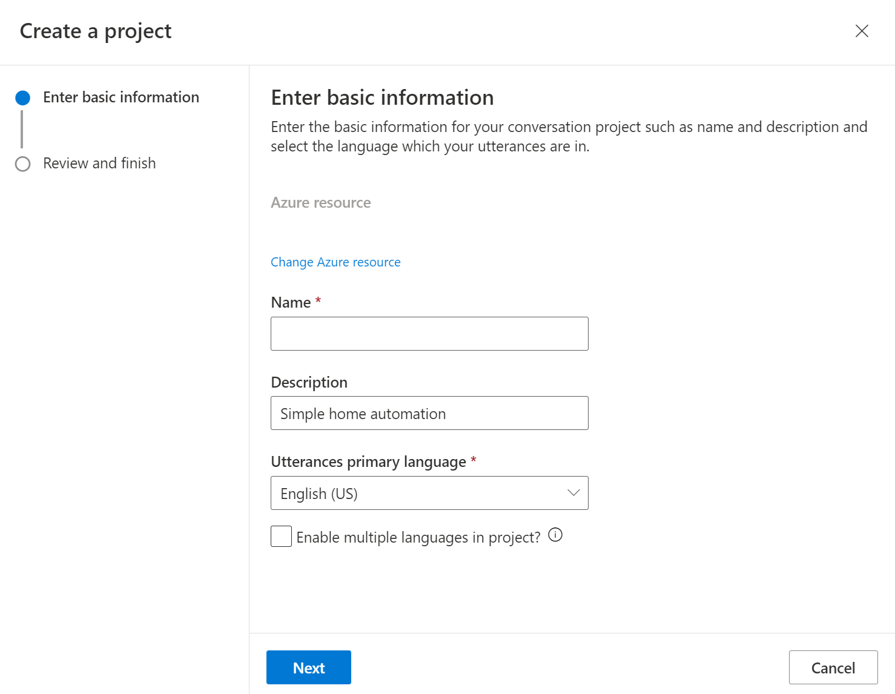

---
lab:
  title: Explorar reconocimiento del lenguaje de Azure
  module: Module 4 - Natural Language Processing (NLP)
---

# <a name="explore-language-understanding"></a>Explorar reconocimiento del lenguaje de Azure

> **Nota** Para completar este laboratorio, necesitará una [suscripción de Azure](https://azure.microsoft.com/free?azure-portal=true) en la que tenga acceso de administrador.

Esperamos que los equipos informáticos puedan usar cada vez más la inteligencia artificial para comprender las órdenes habladas o escritas en lenguaje natural. Por ejemplo, es posible que desee implementar un sistema de automatización del hogar que le permita controlar los dispositivos de su casa mediante comandos de voz como "enciende la luz" o "pon el ventilador", y que un dispositivo con tecnología de IA entienda el comando y realice la acción adecuada.

Para probar las funcionalidades del servicio de reconocimiento del lenguaje conversacional, se usará una aplicación de línea de comandos que se ejecuta en Cloud Shell. Los mismos principios y funcionalidad se aplican en soluciones reales, como sitios web o aplicaciones de teléfono.

## <a name="create-a-language-service-resource"></a>Creación de un recurso del *servicio Language*

Para usar el servicio de reconocimiento del lenguaje conversacional, cree un recurso del **servicio Language**.

Si aún no lo ha hecho, cree un recurso del **servicio Language** en la suscripción de Azure.

1. En otra pestaña del explorador, abra Azure Portal en [https://portal.azure.com](https://portal.azure.com?azure-portal=true) e inicie sesión con su cuenta Microsoft.

1. Haga clic en el botón **&#65291;Crear un recurso**, busque *Language service* y cree un recurso del **servicio Language** con los valores siguientes:
    - Seleccionar características adicionales: *mantenga las características predeterminadas y haga clic en Continuar para crear el recurso*  
    - **Suscripción**: *su suscripción a Azure*.
    - **Grupo de recursos**: *cree o seleccione un grupo de recursos con un nombre único*.
    - **Región**: Este de EE. UU. 2
    - **Nombre**: *escriba un nombre único*.
    - **Plan de tarifa**: S (llamadas de 1K por minuto)
    - **Al marcar esta casilla, certifico que he revisado y reconocido los términos del aviso de IA responsable**: Seleccionado.

1. Revise y cree el recurso y espere a que finalice la implementación.

### <a name="create-a-conversational-language-understanding-app"></a>Creación de una aplicación de reconocimiento del lenguaje conversacional

Para implementar el reconocimiento del lenguaje natural con el reconocimiento del lenguaje conversacional, se crea una aplicación y luego se agregan entidades, intenciones y expresiones para definir los comandos que quiera que ejecute la aplicación.

1. En una pestaña nueva del explorador, abra el portal de Language Studio en [https://language.azure.com](https://language.azure.com?azure-portal=true) e inicie sesión con la cuenta de Microsoft asociada a su suscripción de Azure.

1. Si se le pide que elija un recurso de Language, seleccione la configuración siguiente:
    - **Directorio de Azure**: directorio de Azure que contiene la suscripción.
    - **Suscripción de Azure**: su suscripción a Azure.
    - **Language resource** (Recurso de Language): el recurso de lenguaje que ha creado antes.

    >**Consejo** Si ***no***se le pide que elija un recurso Language, puede deberse a que tiene varios en la suscripción, en cuyo caso:
    >1. En la barra de la parte superior de la página, haga clic en el botón **Configuración (&#9881;)**.
    >1. En la página **Configuración,** vea la pestaña **Recursos**.
    >1. Seleccione el recurso de lenguaje y haga clic en **Cambiar recurso**.
    >1. En la parte superior de la página, haga clic en **Language Studio** para volver a la página principal de Language Studio.

1. En la parte superior del portal, en el menú **Crear nuevo**, seleccione **Comprensión del lenguaje de conversación**.

1. En el cuadro de diálogo **Crear un proyecto**, en la página **Enter basic information** (Escribir información básica), escriba los detalles siguientes y haga clic en **Siguiente**:
    - **Nombre**: *cree un nombre único*
    - **Descripción**: automatización del hogar sencilla
    - **Utterances primary language** (Idioma principal de las expresiones): inglés
    - **Enable multiple languages in project** (Habilitar varios idiomas en el proyecto): *no seleccionar*

    

    >**Consejo** Anote el *nombre del proyecto*, ya que lo usará más adelante.

1. En la página *Revisar y finalizar*, haga clic en **Crear**.

### <a name="create-intents-utterances-and-entities"></a>Creación de intenciones, expresiones y entidades

Una *intención* es una acción que quiere realizar; por ejemplo, encender una luz o apagar un ventilador. En este caso, definirá dos intenciones: una para encender un dispositivo y otra para apagarlo. Para cada intención, especificará *expresiones* de ejemplo que indican el tipo de lenguaje utilizado para indicar la intención.

1. En el panel **Schema definition** (Definición de esquema), asegúrese de que esté seleccionado **Intenciones**. Luego, haga clic en **Agregar**, agregue una intención con el nombre **switch_on** (en minúsculas) y haga clic en **Add intent** (Agregar intención).

    
    

1. Haga clic en la intención **switch_on**. Se le llevará a la página **Etiquetado de datos**. En la lista desplegable **Intención**, seleccione **switch_on**. Junto a la intención **encender**, escriba la expresión ***enciende la luz*** y presione **Entrar** para enviar esta expresión a la lista.

    

1. El servicio de lenguaje necesita al menos cinco ejemplos de expresiones diferentes para cada intención a fin de entrenar suficientemente el modelo de lenguaje. Agregue cinco ejemplos más de expresiones para la intención **switch_on**:  
    - ***encender el ventilador***
    - ***activar el ventilador***
    - ***activa la luz***
    - ***encender la luz***
    - ***encender el ventilador***

1. En el panel **Labeling entities for training** (Etiquetado de entidades para el entrenamiento) en el lado derecho de la pantalla, seleccione **Etiquetas** y luego **Add entity** (Agregar entidad). Escriba **dispositivo** (en minúsculas), elija **Lista** y seleccione **Add entity** (Agregar entidad).

     
    

1. En la expresión ***encender el ventilador***, resalte la palabra "ventilador". A continuación, en la lista que aparece, en el cuadro *Buscar una entidad* seleccione **dispositivo**.

    

1. Haga lo mismo para todas las expresiones. Etiquete el resto de las expresiones de *ventilador* o *luz* con la entidad **dispositivo**. Cuando haya terminado, compruebe que tiene las expresiones siguientes y asegúrese de seleccionar **Guardar cambios**:

    | **intención** | **expresión** | **entidad** |
    | --------------- | ------------------ | ------------------ |
    | switch_on   | Activar el ventilador      | Dispositivo: *seleccionar ventilador* |
    | switch_on   | Activar la luz    | Dispositivo: *seleccionar luz* |
    | switch_on   | Encender la luz | Dispositivo: *seleccionar luz* |
    | switch_on   | Encender el ventilador     | Dispositivo: *seleccionar ventilador* |
    | switch_on   | Encender el ventilador   | Dispositivo: *seleccionar ventilador* |
    | switch_on   | Encender la luz   | Dispositivo: *seleccionar luz* |

     

1. En el panel de la izquierda, haga clic en **Schema definition** (Definición de esquema) y compruebe que la intención **switch_on** (encender) aparece en la lista. Después, haga clic en **Agregar** y agregue una nueva intención con el nombre **apagar** (en minúsculas).

     

1. Haga clic en la intención **apagar**. Se le llevará a la página **Etiquetado de datos**. En la lista desplegable **Intención**, seleccione **switch_off**. Junto a la intención **switch_off**, agregue la expresión ***apagar la luz***.

1. Agregue cinco ejemplos más de expresiones a la intención **switch_off**.
    - ***apagar el ventilador***
    - ***desactiva el ventilador***
    - ***desactivar la luz***
    - ***apagar la luz***
    - ***apagar el ventilador***

1. Etiquete las palabras *luz* o *ventilador* con la entidad **dispositivo**. Cuando haya terminado, compruebe que tiene las expresiones siguientes y asegúrese de seleccionar **Guardar cambios**:  

    | **intención** | **expresión** | **entidad** | 
    | --------------- | ------------------ | ------------------ |
    | switch_off   | Desactivar el ventilador    | Dispositivo: *seleccionar ventilador* | 
    | switch_off   | Desactivar la luz  | Dispositivo: *seleccionar luz* |
    | switch_off   | Apagar la luz | Dispositivo: *seleccionar luz* |
    | switch_off   | Apagar el ventilador | Dispositivo: *seleccionar ventilador* |
    | switch_off   | Apagar el ventilador | Dispositivo: *seleccionar ventilador* |
    | switch_off   | Apaga la luz | Dispositivo: *seleccionar luz* |

### <a name="train-the-model"></a>Entrenamiento del modelo

Ahora está listo para usar las intenciones y entidades que ha definido a fin de entrenar el modelo de lenguaje conversacional de la aplicación.

1. En el lado izquierdo de Language Studio, seleccione **Trabajos de entrenamiento** y, después, **Iniciar un trabajo de entrenamiento**. Use la configuración siguiente: 
    - **Entrenar un nuevo modelo**: *debe estar seleccionado y tiene que elegir un nombre de modelo*
    - **Modo de entrenamiento**: Entrenamiento estándar (gratis)
    - **División de datos**: *seleccione Automatically split the testing set from the training data, keep default percentages (Dividir automáticamente el conjunto de pruebas de los datos de entrenamiento, mantener los porcentajes predeterminados)*
    - En la parte inferior de la página, haga clic en **Entrenar**.

1. Espere a que se complete el entrenamiento. 

### <a name="deploy-and-test-the-model"></a>Implementación y prueba del modelo

Para usar el modelo entrenado en una aplicación cliente, debe implementarlo como un punto de conexión al que las aplicaciones cliente puedan enviar nuevas expresiones; a partir de las cuales se predecirán las intenciones y entidades.

1. En el lado izquierdo de Language Studio, haga clic en **Implementar un modelo**.

1. Seleccione el nombre del modelo y haga clic en **Agregar implementación**. Use estos valores de configuración:
    - **Cree o seleccione un nombre de implementación existente**: *seleccione Crear un nuevo nombre de implementación. Agregar un nombre único*
    - **Asigne un modelo entrenado al nombre de la implementación**: *seleccione el nombre del modelo entrenado*.
    - Haga clic en **Implementar**

    >**Consejo** Anote el *nombre de la implementación*, ya que lo usará más adelante. 

1. Cuando se haya implementado el modelo, haga clic en **Testing deployments** (Probar implementaciones) en el lado izquierdo de la página y, después, seleccione el modelo implementado en **Nombre de implementación**.

1. Escriba el texto siguiente y, después, seleccione **Ejecutar la prueba**:

    *enciende la luz*

     

    Revise el resultado que se devuelve y observe que incluye la intención pronosticada (que debe ser **switch_on**) y la entidad pronosticada (**device**) con una puntuación de confianza que indica la probabilidad que el modelo ha calculado para la intención y la entidad pronosticadas. En la pestaña JSON se muestra la confianza comparativa para cada posible intención (la que tiene la puntuación de confianza más alta es la intención pronosticada).

1. Borre el cuadro de texto y pruebe el modelo con las expresiones siguientes en *Enter your own text (Escriba su propio texto)* :
    - *apaga el ventilador*
    - *activa la luz*
    - *desactiva el ventilador*

## <a name="run-cloud-shell"></a>Ejecución de Cloud Shell

Ahora vamos a probar el modelo implementado. Para ello, se usará una aplicación de línea de comandos que se ejecuta en Cloud Shell en Azure. 

1. Con Language Studio abierto en la pestaña del explorador, vuelva a la pestaña del explorador que contiene Azure Portal.

1. En Azure Portal, seleccione el botón **[>_]** (*Cloud Shell*) situado en la parte superior de la página, a la derecha del cuadro de búsqueda. Al hacer clic en el botón se abre un panel de Cloud Shell en la parte inferior del portal.

    

1. La primera vez que abra Cloud Shell, es posible que se le pida que elija el tipo de shell que desea usar (*Bash* o *PowerShell*). Seleccione **PowerShell**. Si no ve esta opción, omita el paso.  

1. Si se le pide que cree almacenamiento para Cloud Shell, asegúrese de que se haya especificado su suscripción y seleccione **Crear almacenamiento**. A continuación, espere un minuto más o menos a que se cree el almacenamiento. 

    

1. Asegúrese de que el tipo de shell indicado en la parte superior izquierda del panel de Cloud Shell se cambia a *PowerShell*. Si es *Bash*, cambie a *PowerShell* mediante el menú desplegable.

     

1. Espere a que se inicie PowerShell. Debería ver la siguiente pantalla en Azure Portal:  

     

## <a name="configure-and-run-a-client-application"></a>Configuración y ejecución de una aplicación cliente

Ahora se abrirá y editará un script escrito previamente, que ejecutará la aplicación cliente.

1. En el shell de comandos, escriba el comando siguiente para descargar la aplicación de ejemplo y guárdela en una carpeta llamada ai-900.

    ```PowerShell
    git clone https://github.com/MicrosoftLearning/AI-900-AIFundamentals ai-900
    ```

    >**Nota** Si ya usó este comando en otro laboratorio para clonar el repositorio *ai-900*, puede omitir este paso.

1. Los archivos se descargan en una carpeta llamada **ai-900**. El objetivo es ver todos los archivos de esta carpeta y trabajar con ellos. Escriba los comandos siguientes en el shell:

     ```PowerShell
    cd ai-900
    code .
    ```

    Observe cómo el script abre un editor como el de la imagen siguiente: 

    

1. En el panel **Archivos** de la izquierda, seleccione el archivo **understand.ps1** de la carpeta **ai-900**. Este archivo contiene código que usa su modelo de reconocimiento del lenguaje conversacional. 

    

    No se preocupe demasiado por los detalles del código. Lo importante es que usará las instrucciones siguientes a fin de modificar el archivo para especificar el modelo de lenguaje que ha entrenado. 

1. Vuelva a la pestaña del explorador que contiene **Language Studio**. Después, en Language Studio, abra la página **Implementar un modelo** y seleccione el modelo. Luego, haga clic en el botón **Obtener dirección URL de predicción**. Los dos fragmentos de información que necesita se encuentran en este cuadro de diálogo:
    - El punto de conexión del modelo: puede copiar el punto de conexión desde el cuadro **URL de predicción**.
    - La clave del modelo: la clave está en la **solicitud de ejemplo** como valor del parámetro **Ocp-Apim-Subscription-Key** y tiene un aspecto similar a ***0ab1c23de4f56gh7i8901234jkl567m8***.

1. Copie el valor del punto de conexión, vuelva a la pestaña del explorador que contiene Cloud Shell y péguelo en el editor de código, reemplazando **YOUR_ENDPOINT** (entre comillas). Repita ese proceso para la clave y reemplace **YOUR_KEY**.

1. A continuación, reemplace **YOUR_PROJECT_NAME** por el nombre del proyecto y reemplace **YOUR_DEPLOYMENT_NAME** por el nombre del modelo implementado. Las primeras líneas de código deben ser similares a las siguientes:

    ```PowerShell
    $endpointUrl="https://some-name.cognitiveservices.azure.com/language/..."
    $key = "0ab1c23de4f56gh7i8901234jkl567m8"
    $projectName = "name"
    $deploymentName = "name"
    ```

1. En la parte superior derecha del panel del editor, use el botón **...** para abrir el menú y seleccione **Guardar** para guardar los cambios. A continuación, vuelva a abrir el menú y seleccione **Cerrar editor**.

1. En el panel de PowerShell, escriba el siguiente comando para ejecutar el código:

    ```PowerShell
    ./understand.ps1 "Turn on the light"
    ```

1. Consulte los resultados. La aplicación debería haber predicho que la acción prevista es encender la luz.

1. Ahora pruebe otro comando:

    ```PowerShell
    ./understand.ps1 "Switch the fan off"
    ```

1. Revise los resultados de este comando. La aplicación debería haber predicho que la acción prevista es apagar el ventilador.

1. Experimente con algunos comandos más, incluyendo comandos para los que el modelo no ha sido entrenado, como "Hola" o "enciende el horno". Por lo general, la aplicación debe comprender los comandos para los que está definido su modelo de lenguaje y producir un error correctamente para otras entradas.

>**Nota** Cada vez que tenga que empezar con **./understand.ps1**  seguido de la frase. incluya la frase entre comillas.

## <a name="learn-more"></a>Más información

Esta aplicación solo muestra algunas de las funcionalidades de la característica Conversational Language Understanding del servicio Language. Para obtener más información sobre lo que se puede hacer con este servicio, consulte la [página de reconocimiento del lenguaje conversacional](https://docs.microsoft.com/azure/cognitive-services/language-service/conversational-language-understanding/overview). 
