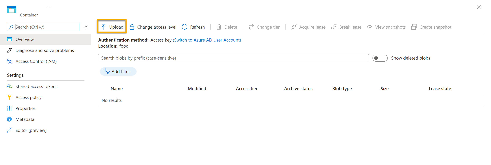

---
lab:
  title: Explorar minería de conocimientos
---

# Explorar minería de conocimientos

> **Nota** Para completar este laboratorio, necesitará una [suscripción de Azure](https://azure.microsoft.com/free?azure-portal=true) en la que tenga acceso de administrador.

Imaginemos que trabaja para Fourth Coffee, una cadena nacional dedicada al café. Le han pedido que ayude a crear una solución de minería de conocimientos que permita buscar fácilmente información sobre las experiencias de los clientes. Decide crear un índice de Azure Cognitive Search con datos extraídos de las opiniones de los clientes.  

En este laboratorio:

- Creación de recursos de Azure
- Extraerá datos de un origen de datos.
- Enriquecerá datos con aptitudes de inteligencia artificial.
- Uso del indizador de Azure en Azure Portal
- Consultar el índice de búsqueda
- Revisión de los resultados guardados en un almacén de conocimiento

## Recursos de Azure necesarios

La solución que va a crear para Fourth Coffee requiere los siguientes recursos de su suscripción de Azure:

- Un recurso de **Azure Cognitive Search** que administre el proceso de indexación y de consulta.
- Un recurso de **Cognitive Services** que proporcione servicios de inteligencia artificial para las aptitudes que la solución de búsqueda puede usar para enriquecer los datos del origen de datos con información generada mediante inteligencia artificial.

    > **Nota** Los recursos de Azure Cognitive Search y Cognitive Services deben estar en la misma ubicación.

- Una **cuenta de almacenamiento** con contenedores de blobs, que almacenará documentos sin procesar y otras colecciones de tablas, objetos o archivos.

### Crear un recurso de *Azure Cognitive Search*

1. Inicia sesión en [Azure Portal](https://portal.azure.com/learn.docs.microsoft.com?azure-portal=true).

1. Haga clic en el botón **+ Crear un recurso**, busque *Azure Cognitive Search* y cree un recurso de **Azure Cognitive Search** con los valores siguientes:

    - **Suscripción**: *su suscripción a Azure*.
    - **Grupo de recursos**: *cree o seleccione un grupo de recursos con un nombre único*.
    - **Nombre de servicio**: *un nombre único*.
    - **Ubicación**: *elija cualquier región disponible*.
    - **Plan de tarifa**: básico

1. Seleccione **Revisar y crear** y, después de ver la respuesta **Validación correcta**, seleccione **Crear**.

1. Una vez finalizada la implementación, seleccione **Ir al recurso**. En la página de información general de Azure Cognitive Search, puede agregar índices, importar datos y buscar índices creados.

### Creación de un recurso de Cognitive Services

Deberá aprovisionar un recurso de **Cognitive Services** que se encuentre en la misma ubicación que el recurso de Azure Cognitive Search. La solución de búsqueda usará este recurso para enriquecer los datos del almacén de datos con información generada con inteligencia artificial.

1. Vuelva a la página principal de Azure Portal y seleccione el botón **+ Crear un recurso**, busque *Cognitive Services* y cree un recurso de **Cognitive Services** con los valores siguientes: 
    - **Suscripción**: *su suscripción a Azure*.
    - **Grupo de recursos**: *el mismo grupo de recursos que el recurso de Azure Cognitive Search*.
    - **Región**: *la misma ubicación que el recurso de Azure Cognitive Search*.
    - **Nombre**: *un nombre único*.
    - **Plan de tarifa**: estándar S0
    - **Al marcar esta casilla, confirmo que he leído y comprendido todos los términos que aparecen a continuación**: Seleccionado

1. Seleccione **Revisar + crear**. Cuando vea la respuesta **Validación superada**, seleccione **Crear**.

1. Espere a que se complete la implementación y vea los detalles de dicha implementación.

### Crear una cuenta de almacenamiento

1. Vuelva a la página principal de Azure Portal y seleccione el botón **+ Crear un recurso**.

1. Busque *cuenta de almacenamiento* y cree un recurso **Cuenta de almacenamiento** con la siguiente configuración:
    - **Suscripción**: *su suscripción a Azure*.
    - **Grupo de recursos**: *el mismo grupo de recursos que el de los recursos de Azure Cognitive Search y Cognitive Services*.
    - **Nombre de la cuenta de Storage**: *un nombre único*.
    - **Ubicación**: *elija cualquier ubicación disponible*.
    - **Rendimiento**: Estándar
    - **Redundancia**: Almacenamiento con redundancia local (LRS)

1. Haga clic en **Revisar**, y después en **Crear**. Espere a que se complete la implementación y, a continuación, vaya al recurso implementado.

## Carga de documentos en Azure Storage

1. En la cuenta de Azure Storage que creó, en el panel de menús izquierdo, seleccione **Contenedores**.

    

1. Seleccione **+ Contenedor**. Se abre un panel a la derecha.

1. Especifique las siguientes opciones de configuración y, a continuación, haga clic en **Crear**:
    - **Nombre**: opiniones-café  
    - **Nivel de acceso público**: contenedor (acceso de lectura anónimo para contenedores y blobs)
    - **Avanzado**: *sin cambios*.

1. En una nueva pestaña del explorador, descargue los documentos comprimidos de https://aka.ms/km-documents y extraiga los archivos en la carpeta *revisiones* .

1. En el Azure Portal, seleccione el contenedor *de revisiones de café*. En el contenedor, seleccione **Cargar**.

    

1. En el panel **Cargar blob**, seleccione **Seleccionar un archivo**.

1. En la ventana del explorador, seleccione **todos** los archivos de la carpeta *reviews*, elija **Abrir** y, después, **Cargar**.

    

1. Una vez completada la carga, puede cerrar el panel **Cargar blob**. Ahora los documentos están en el contenedor de almacenamiento *coffee-reviews*.

## Indexación de los documentos

Cuando tenga los documentos almacenados, podrá usar Azure Cognitive Search para extraer información de estos. Azure Portal proporciona el asistente *Importar datos*. Con este asistente, puede crear automáticamente un índice y un indexador para los orígenes de datos admitidos. Usará el asistente para crear un índice e importar los documentos de búsqueda del almacenamiento al índice de Azure Cognitive Search.

1. En Azure Portal, navegue hasta el recurso de Azure Cognitive Search. En la página **Información general**, seleccione **Importar datos**.

    

1. En la página **Conexión a los datos**, en la lista **Origen de datos**, seleccione **Azure Blob Storage**. Rellene los detalles del almacén de datos con los valores siguientes:
    - **Origen de datos**: Azure Blob Storage
    - **Nombre del origen de datos**: datos-clientes-café
    - **Datos que se extraerán**: contenido y metadatos
    - **Modo de análisis**: predeterminado
    - **Cadena de conexión**: *seleccione **Elegir una conexión existente**. Seleccione la cuenta de almacenamiento, elija el contenedor **coffee-reviews** y haga clic en **Seleccionar**.
    - **Autenticación de identidad administrada**: ninguna
    - **Nombre del contenedor**: *esta opción se rellena automáticamente tras elegir una conexión existente*.
    - **Carpeta de blobs**: *dejar en blanco*.
    - **Descripción**: Reseñas de los establecimientos de Fourth Coffee.

1. Seleccione **Siguiente: Agregar conocimientos cognitivos (opcional)**.

1. En la sección **Adjuntar Cognitive Services**, seleccione el recurso de Cognitive Services.  

1. En la sección **Agregar enriquecimientos**, haga lo siguiente:
    - Cambie el **nombre del conjunto de aptitudes** a **conjunto de aptitudes-café**.
    - Seleccione la casilla **Habilitar OCR y combinar todo el texto en el campo merged_content**.
        > **Nota** Es importante seleccionar **Habilitar OCR** para ver todas las opciones del campo enriquecido.
    - Asegúrese de que el **Campo de datos de origen** está establecido en **merged_content**.
    - Cambie el **nivel de granularidad de enriquecimiento** a **Páginas (fragmentos de 5000 caracteres)**.
    - No seleccione *Enable incremental enrichment* (Habilitar enriquecimiento incremental).
    - Seleccione los siguientes campos enriquecidos:

        | Conocimiento cognitivo | Parámetro | Nombre del campo |
        | --------------- | ---------- | ---------- |
        | Extracción de nombres de ubicaciones | | locations |
        | Extracción de frases clave | | keyphrases |
        | Detección de opiniones | | opinión |
        | Generación de etiquetas a partir de imágenes | | imageTags |
        | Generación de descripciones a partir de imágenes | | imageCaption |

1. En **Guardar enriquecimientos en un almacén de conocimientos**, seleccione:
    - Image projections (Proyecciones de la imagen)
    - Documentos
    - Páginas
    - Frases clave
    - Entities
    - Detalles de la imagen
    - Image references (Referencias de la imagen)

    > **Nota** Si aparece una advertencia que solicita una **Cadena de conexión de cuenta de almacenamiento**.
    >
    > 

    > 1. Seleccione **Elegir una conexión existente**. Elija la cuenta de almacenamiento creada anteriormente.

    > 1. Haga clic en **+ Contenedor** para crear un nuevo contenedor denominado **knowledge-store** con el nivel de privacidad establecido en privado y seleccione **Crear**.

    > 1. Seleccione el contenedor **knowledge-store** y haga clic en **Seleccionar** en la parte inferior de la pantalla.

1. Seleccione **Proyectos de blobs de Azure: Documento**. Aparece *Nombre del contenedor* con el valor *knowledge-store*, que se ha rellenado automáticamente. No cambie el nombre del contenedor

1. Seleccione **Siguiente: Personalizar el índice de destino**. Cambie el **Nombre del índice** a **coffee-index**.

1. Asegúrese de que el campo **Clave** está establecido en **metadata_storage_path**. Deje **Nombre del proveedor de sugerencias** en blanco y **Modo de búsqueda** con el valor que se rellena automáticamente.

1. Revise la configuración predeterminada de los campos del índice. Seleccione **Filtrable** para todos los campos que ya están seleccionados de manera predeterminada.

    

1. Seleccione **Siguiente: Crear indizador**.

1. Cambie el **Indexer name** (Nombre del indizador) a **coffee-indexer**.

1. Deje la **Programación** establecida en **Una vez**.

1. Expanda las **Opciones avanzadas**. Asegúrese de que la opción **Claves de codificación Base 64** está seleccionada, ya que las claves de codificación pueden hacer que el índice sea más eficaz.

1. Seleccione **Enviar** para crear un origen de datos, un conjunto de aptitudes, un índice y un indexador. El indexador se ejecuta automáticamente y ejecuta la canalización de indexación, que hace lo siguiente:
    - Extrae los campos de metadatos del documento y el contenido del origen de datos.
    - Ejecuta el conjunto de aptitudes cognitivas para generar campos más enriquecidos.
    - Asigna los campos extraídos al índice.

1. En la mitad inferior de la página **Información general** del recurso de Azure Cognitive Search, seleccione la pestaña **Indizadores**, donde se muestra el elemento **coffee-indexer** recién creado. Espere un momento y seleccione **&orarr; Actualizar** hasta que el campo **Estado** indique que se ha realizado correctamente.

1. Seleccione el nombre del indexador para ver más detalles.

    

## Consultas al índice

Use el explorador de búsqueda para escribir y probar consultas. El Explorador de búsqueda es una herramienta integrada en Azure Portal que ofrece una manera fácil de validar la calidad del índice de búsqueda. Puede usar el Explorador de búsqueda para escribir consultas y revisar los resultados en JSON.

1. En la página *Información general* del servicio Search, seleccione **Explorador de búsqueda**, que encontrará en la parte superior.

   

1. Observe que el índice seleccionado es *coffee-index* que había creado.

    

    En el campo **Cadena de consulta**, escriba `search=*&$count=true` y, a continuación, seleccione **Buscar**. La consulta de búsqueda devuelve todos los documentos del índice de búsqueda, incluido un recuento de los documentos en el campo **@odata.count**. El índice de búsqueda debe devolver un documento JSON que contiene los resultados de la búsqueda.

    > **Nota** Si aparece un elemento **Para buscar en el portal, permita el origen del portal en el mensaje de configuración de CORS de índice**, seleccione **Permitir portal** y, a continuación, seleccione **Buscar**.

1. Ahora vamos a filtrar por ubicación. Escriba `search=$filter=locations eq 'Chicago'` en el campo **Cadena de consulta** y, a continuación, seleccione **Buscar**. La consulta busca en todos los documentos del índice y filtra las revisiones con una ubicación de Chicago.

1. Ahora vamos a filtrar por opinión. Escriba `search=$filter=sentiment eq 'negative'` en el campo **Cadena de consulta** y, a continuación, seleccione **Buscar**. La consulta busca en todos los documentos del índice y filtra las revisiones con una opinión negativa.

   > **Nota** Vea cómo los resultados se ordenan por `@search.score`. Se trata de la puntuación que el motor de búsqueda asigna para mostrar la proximidad de los resultados con la consulta en cuestión.

1. Uno de los problemas que quizá queramos resolver es por qué puede haber ciertas opiniones. Echemos un vistazo a las frases clave asociadas a una opinión negativa. ¿Cuál cree que puede ser la causa de la opinión?

## Revisión del almacén de conocimiento

Veamos el potencial del almacén de conocimientos en acción. Cuando ejecutó el *Asistente para importación de datos*, también creó un almacén de conocimiento. Dentro del almacén de conocimientos, verá que los datos enriquecidos extraídos por las aptitudes de inteligencia artificial persisten en forma de proyecciones y tablas.

1. En Azure Portal, vuelva a la cuenta de almacenamiento de Azure.

1. En el panel de menús izquierdo, seleccione **Contenedores**. Seleccione el contenedor **knowledge-store**.

    

1. Seleccione cualquiera de los elementos y haga clic en el archivo **objectprojection.json**.

    

1. Seleccione **Editar** para ver el archivo JSON generado para uno de los documentos del almacén de datos de Azure.

    

1. Vuelva a la ruta de navegación de Storage Blob en la parte superior izquierda de la pantalla para volver a la cuenta de almacenamiento *Contenedores*.

    

1. En *Contenedores*, seleccione el contenedor *coffee-skillset-image-projection*. Seleccione cualquiera de los elementos.

    

1. Seleccione cualquiera de los archivos *.jpg*. Seleccione **Editar** para ver la imagen almacenada del documento. Observe cómo todas las imágenes de los documentos se almacenan de esta manera.

    

1. Vuelva a la ruta de navegación de Storage Blob en la parte superior izquierda de la pantalla para volver a la cuenta de almacenamiento *Contenedores*.

1. Seleccione **Explorador de almacenamiento** en el panel izquierdo y seleccione **Tablas**. Hay una tabla para cada entidad del índice. Seleccione la tabla *coffeeSkillsetKeyPhrases*.

    Eche un vistazo a las frases clave que el almacén de conocimientos pudo capturar del contenido de las opiniones. Muchos de los campos son claves, por lo que puede vincular las tablas como una base de datos relacional. El último campo muestra las frases clave que extrajo el conjunto de aptitudes.

## Más información

Este índice de búsqueda simple solo contiene algunas de las funcionalidades del servicio Azure Cognitive Search. Para obtener más información sobre lo que puede hacer gracias a este servicio, consulte la [página del servicio Azure Cognitive Search](/azure/search/search-what-is-azure-search).
